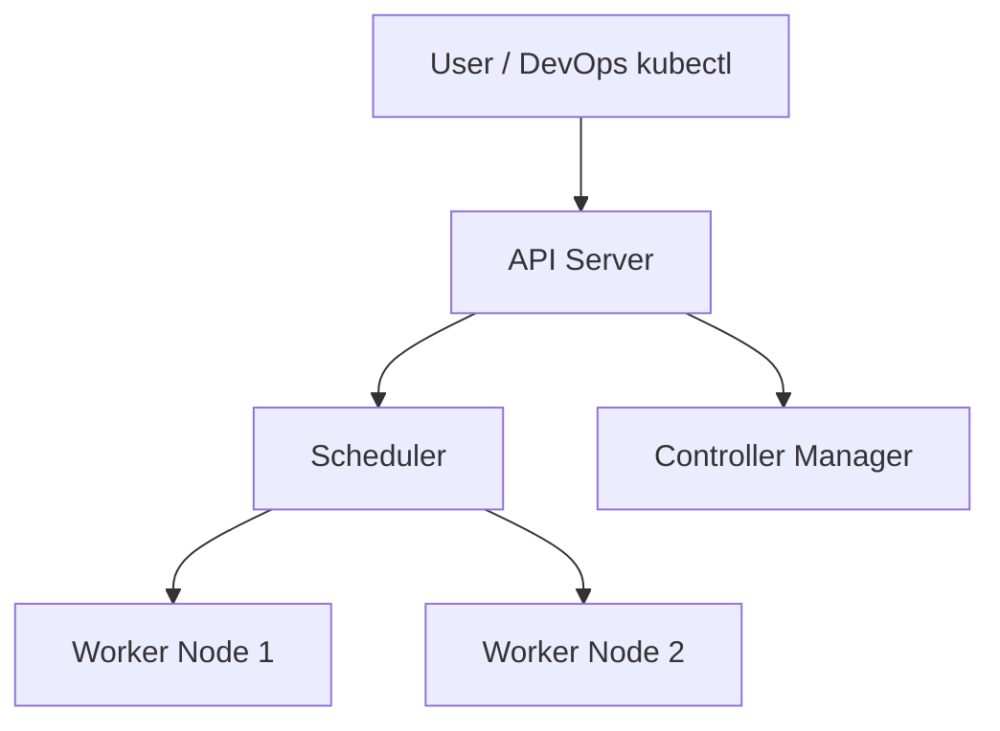
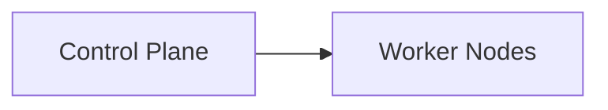
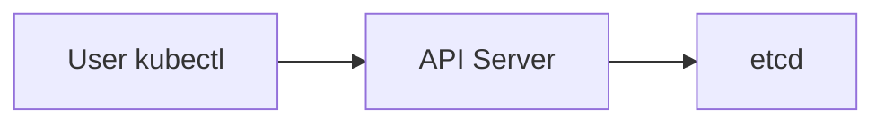
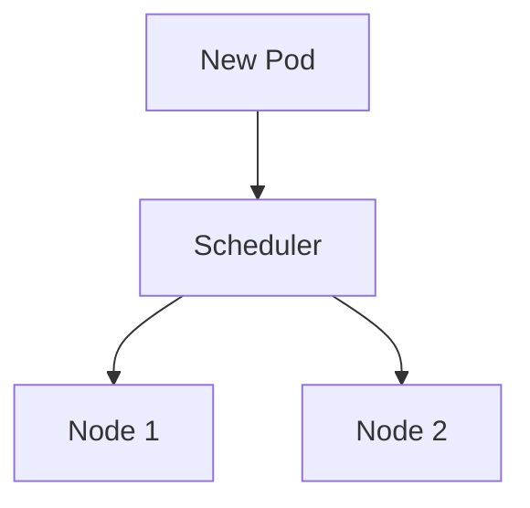
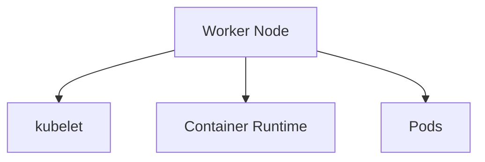
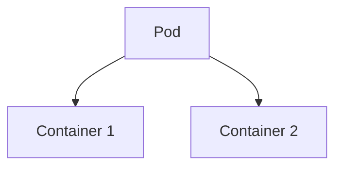
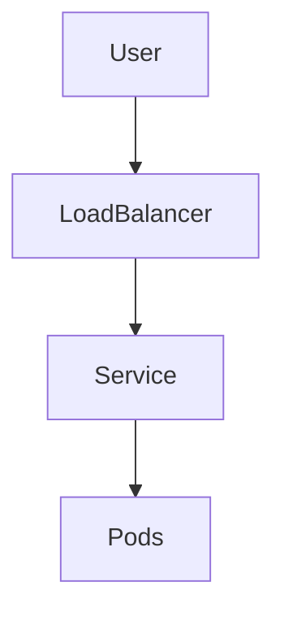
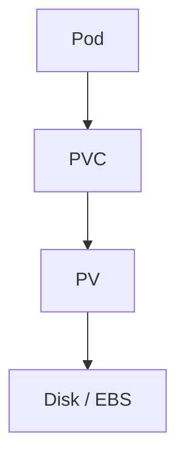
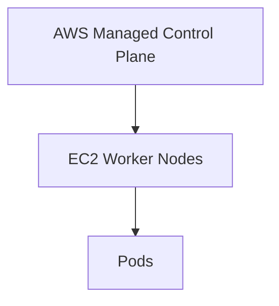

# 🏗️ Kubernetes Architecture & Core Components

> **Audience:** Absolute Beginners → Intermediate
> **Purpose:** Build a **rock-solid mental model** of Kubernetes
> **Style:** Visual (Mermaid diagrams) + Real-life analogies + Clear responsibilities
> **Mapped To:** **Unit I, Unit II & Unit III**

---

## 🧠 Why Understanding Architecture is CRITICAL

Most learners memorize commands.

**Professionals understand architecture.**

If you understand:

* Who talks to whom
* Who decides what
* Who enforces what

👉 Kubernetes becomes **logical**, not scary.

---

## 🌍 Big Picture: What is Kubernetes?

> Kubernetes is a **distributed operating system for containers**.

### Real-life Analogy 🏙️

| Real World               | Kubernetes           |
| ------------------------ | -------------------- |
| City                     | Cluster              |
| City Government          | Control Plane        |
| Buildings                | Nodes                |
| Flats                    | Pods                 |
| Electricity / Water Dept | Networking & Storage |
| Security Office          | RBAC                 |

---

## 🧩 Kubernetes Cluster – High-Level View



> Everything in Kubernetes starts and ends with **API Server**.

---

## 🏛️ Kubernetes Architecture Breakdown

Kubernetes has **two major parts**:

1. 🧠 Control Plane (Brain)
2. 💪 Worker Nodes (Muscles)



---

## 🧠 CONTROL PLANE COMPONENTS (Decision Makers)

> Control Plane **never runs your application**.
> It only **decides and manages**.

---

### 1️⃣ API Server (kube-apiserver)

#### 🔹 What it is

* Front door of Kubernetes
* REST API endpoint

#### 🔹 What it does

* Accepts requests from:

  * kubectl
  * Controllers
  * Scheduler
* Validates & authenticates requests
* Stores state in etcd

#### Real-life Analogy 🏛️

> Government reception desk



---

### 2️⃣ etcd (Cluster Database)

#### 🔹 What it is

* Distributed key-value store
* Single source of truth

#### 🔹 What it stores

* Pods
* Deployments
* Secrets
* ConfigMaps

#### Real-life Analogy 🗄️

> Central government records room

⚠️ **If etcd is lost → cluster is lost**

---

### 3️⃣ Scheduler

#### 🔹 What it does

* Decides **WHERE** a pod should run
* Looks at:

  * CPU
  * Memory
  * Node health



#### Real-life Analogy 🧑‍✈️

> Airport gate allocator

---

### 4️⃣ Controller Manager

#### 🔹 What it does

* Ensures **desired state == actual state**

Examples:

* Pod crashed → recreate
* Replicas = 3 → always maintain 3

#### Real-life Analogy 🔁

> Automatic quality control system

---

## 💪 WORKER NODE COMPONENTS (Execution Layer)

> Worker Nodes **run your application containers**.



---

### 5️⃣ kubelet

#### 🔹 What it does

* Talks to API Server
* Starts & monitors pods

#### Real-life Analogy 👷

> Building supervisor

---

### 6️⃣ Container Runtime (Docker / containerd)

#### 🔹 What it does

* Pulls images
* Runs containers

#### Real-life Analogy 🚚

> Delivery & execution engine

---

### 7️⃣ kube-proxy

#### 🔹 What it does

* Handles networking rules
* Enables Services

#### Real-life Analogy 🚦

> Traffic police

---

## 📦 Kubernetes Objects (What You Create)

### Pod (Smallest Unit)



> One Pod = One IP

Real-life: **Single apartment**

---

### ReplicaSet

* Ensures fixed number of Pods

Real-life: **Minimum staff policy**

---

### Deployment

* Manages ReplicaSets
* Enables rolling updates

Real-life: **Project manager**

---

### Namespace

* Logical isolation

Real-life: **Different floors in building**

---

## 🌐 Kubernetes Networking (Unit III Link)



### Service Types

| Service      | Purpose            | Real-life       |
| ------------ | ------------------ | --------------- |
| ClusterIP    | Internal access    | Office intercom |
| NodePort     | External testing   | Reception desk  |
| LoadBalancer | Production traffic | Main gate       |

---

## 📂 Storage Architecture (Unit III Link)



Real-life: **Plugging appliance into wall socket**

---

## 🔐 Security Architecture (Unit II Link)

```mermaid
graph LR
    User --> RBAC
    RBAC --> API Server
```

RBAC controls **who can talk to API Server**.

---

## ☁️ Managed Kubernetes (EKS Perspective)



* AWS manages Control Plane
* You manage applications

---

## 🏭 Kubernetes in Industry

Used by:

* Netflix
* Amazon
* Spotify
* Airbnb

For:

* Auto-scaling
* Self-healing
* Zero downtime deployments

---

## 🎯 Final Mental Model

> Kubernetes is a **manager**, not a worker.
> It decides **what should happen**, not **how you code**.

---

## ✅ Key Takeaway for Exams & Interviews

* API Server = Heart
* etcd = Brain memory
* Scheduler = Decision maker
* Controller = Enforcer
* kubelet = Executor

---

📌 **End of Architecture Guide**
