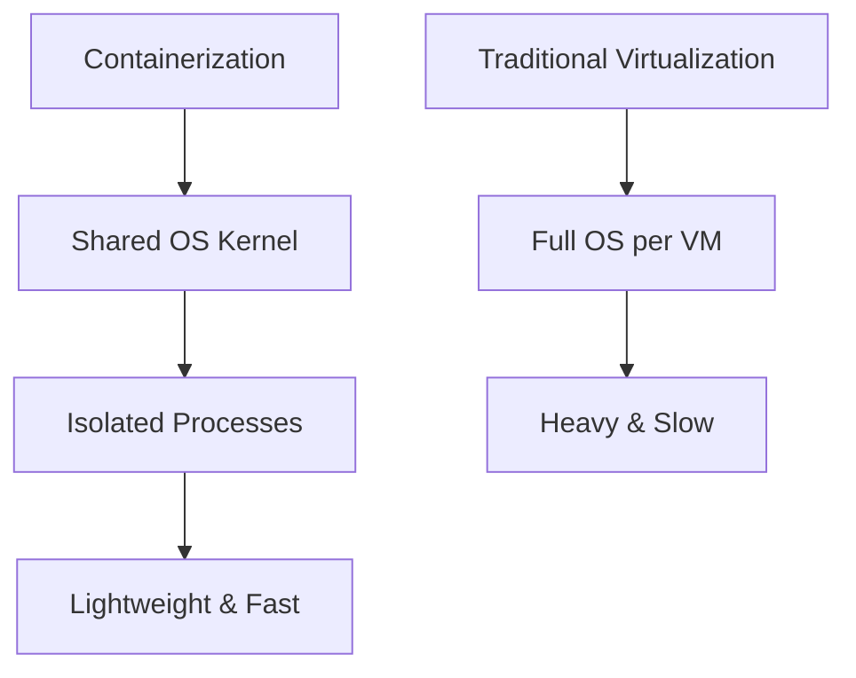
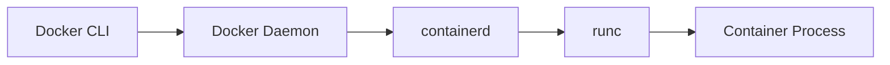
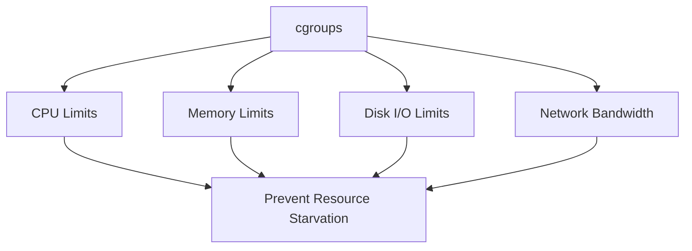
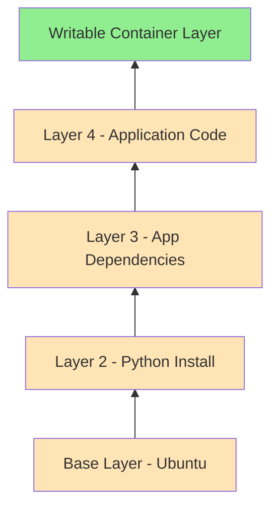
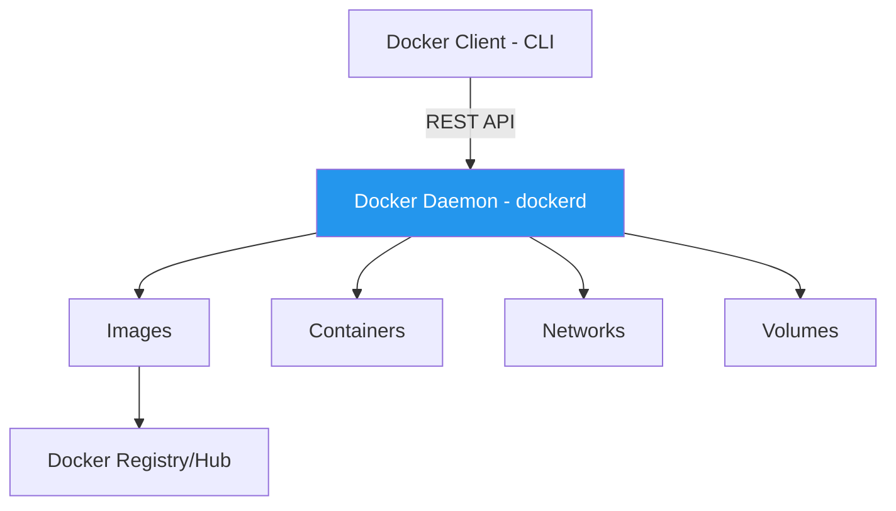
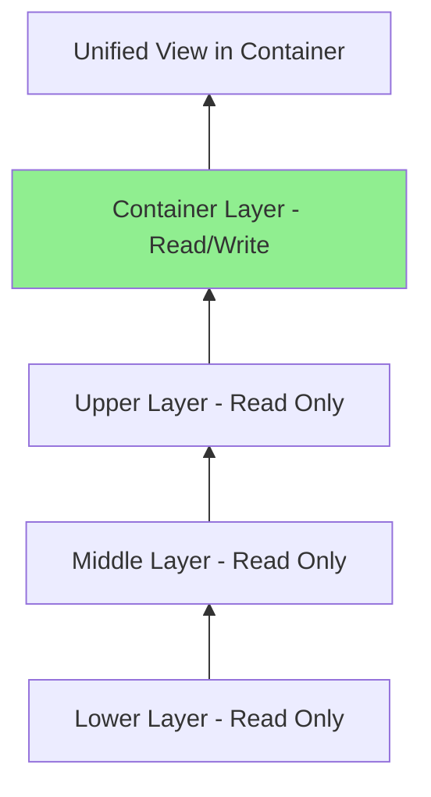
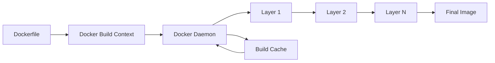
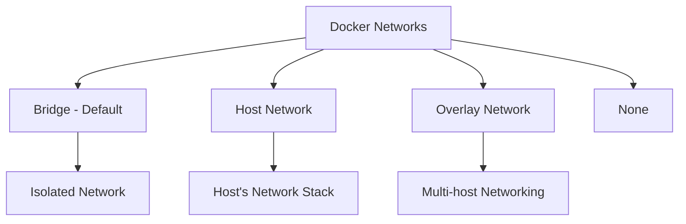
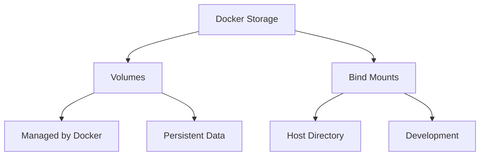

# 🚀 DevOps Infrastructure: Complete Docker Guide

## UNIT 1 – Basics of DevOps Infrastructure

### 📦 Introduction to Containers

#### Origin of Containers

Containers emerged from Linux kernel features designed to isolate processes. The fundamental technologies that enable containerization include namespaces (for process isolation) and cgroups (for resource management).[1][2][3][4]



#### 🔧 Container Runtime

Container runtimes execute and manage containers. The container runtime stack consists of:[5]

- **containerd**: High-level container runtime that manages container lifecycle
- **runc**: Low-level OCI-compliant runtime that creates and runs containers[6][5]



**Practical Example:**
```bash
# Check your container runtime
docker info | grep -i runtime

# Output shows:
# Runtimes: runc io.containerd.runc.v2
# Default Runtime: runc
```

#### 🔒 Process Isolation & Namespaces

Namespaces provide isolated views of system resources to containers. Linux provides several namespace types:[3][1]

| Namespace | Purpose | Isolation |
|-----------|---------|-----------|
| **PID** | Process IDs | Each container sees its own process tree [3] |
| **NET** | Network stack | Separate network interfaces, IP addresses [3] |
| **MNT** | Filesystem mounts | Isolated mount points [3] |
| **UTS** | Hostname | Different hostname per container [3] |
| **IPC** | Inter-process communication | Isolated message queues [3] |
| **USER** | User IDs | Map container users to host users [3] |

**Practical Example:**
```bash
# Run a container and check its isolated PID namespace
docker run -d --name test-namespace nginx

# Check process from host perspective
docker inspect test-namespace | grep Pid

# Check process from container perspective (PID 1)
docker exec test-namespace ps aux

# Output shows nginx as PID 1 inside container
# but different PID on host
```

#### ⚙️ Control Groups (cgroups) for Resource Limits

Cgroups limit and monitor resource usage for containers. They control CPU, memory, disk I/O, and network bandwidth allocation.[2][4][1]



**Practical Example:**
```bash
# Run container with CPU and memory limits
docker run -d \
  --name limited-container \
  --cpus="1.5" \
  --memory="512m" \
  --memory-swap="1g" \
  nginx

# Verify the limits
docker inspect limited-container | grep -A 10 "Memory"

# Check cgroup settings (on Linux host)
cat /sys/fs/cgroup/memory/docker/$(docker inspect -f '{{.Id}}' limited-container)/memory.limit_in_bytes

# Run stress test to see limits in action
docker exec limited-container apt-get update && apt-get install -y stress
docker exec limited-container stress --vm 1 --vm-bytes 600M --timeout 10s
# Container will be limited to 512MB
```

#### 🖼️ Container Images & Layers

Container images are built from layers stacked on top of each other. Each layer represents a filesystem change and is immutable.[7][8][9][10]



**Practical Example:**
```bash
# Pull an image and inspect its layers
docker pull nginx:latest

# View image layers and history
docker history nginx:latest

# Output shows each layer with size and command:
# IMAGE          CREATED       CREATED BY                                      SIZE
# abc123...      2 weeks ago   /bin/sh -c #(nop)  CMD ["nginx" "-g" "daemon...  0B
# def456...      2 weeks ago   /bin/sh -c #(nop)  EXPOSE 80                     0B

# Inspect detailed layer information
docker inspect nginx:latest | grep -A 20 "Layers"
```

#### 📚 Image Registries & Distribution

Image registries store and distribute container images. Popular registries include:[11][12]

- **Docker Hub**: Public registry with official images
- **GitHub Container Registry (GHCR)**: Integrated with GitHub
- **Private Registries**: Self-hosted or cloud-based

**Practical Example:**
```bash
# Pull from Docker Hub
docker pull nginx:alpine

# Tag image for different registries
docker tag nginx:alpine yourusername/nginx:alpine

# Login to Docker Hub
docker login
# Enter username and password

# Push to Docker Hub
docker push yourusername/nginx:alpine

# Login to GitHub Container Registry
echo $GITHUB_TOKEN | docker login ghcr.io -u USERNAME --password-stdin

# Tag and push to GHCR
docker tag nginx:alpine ghcr.io/username/nginx:alpine
docker push ghcr.io/username/nginx:alpine
```

### 🐳 Introduction to Docker

Docker is a platform that packages applications into containers. It simplifies development, shipping, and deployment by ensuring consistency across environments.[13]

#### Docker Architecture



#### 🎯 Docker Daemon

The Docker daemon (`dockerd`) runs on the host system and manages Docker objects. It listens for Docker API requests and handles container lifecycle operations.[5]

**Practical Example:**
```bash
# Check Docker daemon status
sudo systemctl status docker

# View Docker daemon configuration
docker system info

# Monitor Docker daemon events in real-time
docker events

# In another terminal, run a container to see events
docker run hello-world
```

#### 💻 Docker CLI

The Docker Command Line Interface (CLI) allows users to interact with the Docker daemon.

**Practical Example:**
```bash
# Basic CLI commands
docker --version
docker info

# Container management
docker ps                    # List running containers
docker ps -a                 # List all containers
docker images                # List images

# Get help for any command
docker run --help
docker build --help
```

#### 🏪 Docker Registry & Hub

Docker Hub is the default public registry. Registries store and distribute Docker images.[11]

**Practical Example:**
```bash
# Search for images on Docker Hub
docker search python

# Pull specific version
docker pull python:3.11-slim

# View local images
docker images python

# Remove an image
docker rmi python:3.11-slim
```

#### 🧩 Object Types

Docker manages several object types:

| Object | Description | Example Command |
|--------|-------------|----------------|
| **Container** | Running instance of an image | `docker run nginx` |
| **Image** | Template for containers | `docker build -t myapp .` |
| **Network** | Communication between containers [14] | `docker network create mynet` |
| **Volume** | Persistent data storage [15] | `docker volume create mydata` |

**Practical Example:**
```bash
# Create and inspect all object types

# 1. Create a volume
docker volume create app-data
docker volume ls
docker volume inspect app-data

# 2. Create a network
docker network create app-network
docker network ls
docker network inspect app-network

# 3. Build an image
echo 'FROM nginx:alpine' > Dockerfile
echo 'COPY index.html /usr/share/nginx/html/' >> Dockerfile
echo '<h1>Hello Docker!</h1>' > index.html
docker build -t my-nginx .
docker images my-nginx

# 4. Run a container with all objects
docker run -d \
  --name web-app \
  --network app-network \
  -v app-data:/data \
  -p 8080:80 \
  my-nginx

docker ps
docker inspect web-app
```

#### 📚 Docker Layering & Filesystem

Docker uses a layered filesystem (OverlayFS) where each layer is read-only except the top container layer.[9][10][7]



**Copy-on-Write Mechanism**: When a container modifies a file from a lower layer, Docker copies it to the writable container layer.[9]

**Practical Example:**
```bash
# Create a simple Dockerfile to demonstrate layering
cat > Dockerfile <<EOF
FROM ubuntu:22.04
RUN apt-get update && apt-get install -y curl
RUN apt-get install -y vim
RUN echo "Layer 3" > /layer3.txt
RUN echo "Layer 4" > /layer4.txt
EOF

# Build and observe layers
docker build -t layered-demo .

# Each RUN creates a new layer
docker history layered-demo

# Check the filesystem driver
docker info | grep "Storage Driver"
# Output: Storage Driver: overlay2

# Inspect overlay2 structure
docker inspect layered-demo | grep -A 10 "GraphDriver"
```

***

## UNIT 2 – Image Building & Container Management

### 📝 Dockerfile Core Concepts

#### Image Layering

Each Dockerfile instruction creates a new layer. Layers are cached to speed up builds.[16][8][13]

**Best Practice**: Order instructions from least to most frequently changing.[16][13]

```dockerfile
# ❌ BAD: Application code changes frequently
FROM node:18
COPY . /app
RUN npm install

# ✅ GOOD: Dependencies change less frequently
FROM node:18
COPY package*.json /app/
RUN npm install
COPY . /app
```

#### 🚫 Build Context & .dockerignore

The build context includes all files sent to the Docker daemon during build.[13]

**Practical Example:**
```bash
# Create project structure
mkdir my-app && cd my-app
mkdir node_modules logs .git

# Create .dockerignore file
cat > .dockerignore <<EOF
node_modules
npm-debug.log
.git
.gitignore
README.md
.env
logs/
*.log
.DS_Store
EOF

# Create Dockerfile
cat > Dockerfile <<EOF
FROM node:18-alpine
WORKDIR /app
COPY package*.json ./
RUN npm install
COPY . .
EXPOSE 3000
CMD ["node", "app.js"]
EOF

# Build without .dockerignore (slower, larger context)
# Build with .dockerignore (faster, smaller context)
docker build -t my-app:v1 .

# Check build context size
docker build --no-cache -t my-app:v1 . 2>&1 | grep "Sending build context"
```

#### ✍️ Dockerfile Writing - Basic Instructions

**Comprehensive Example:**
```dockerfile
# FROM: Base image with specific version [web:6]
FROM python:3.11-slim AS base

# WORKDIR: Set working directory
WORKDIR /app

# ENV: Set environment variables
ENV PYTHONUNBUFFERED=1 \
    PYTHONDONTWRITEBYTECODE=1 \
    APP_HOME=/app

# COPY: Copy files from build context
COPY requirements.txt .

# RUN: Execute commands during build
RUN pip install --no-cache-dir -r requirements.txt && \
    apt-get update && \
    apt-get install -y --no-install-recommends curl && \
    apt-get clean && \
    rm -rf /var/lib/apt/lists/*

# ADD: Copy and extract archives (use COPY for regular files)
# ADD archive.tar.gz /opt/

# COPY application code
COPY ./src ./src
COPY ./config ./config

# EXPOSE: Document ports (doesn't publish)
EXPOSE 8000

# VOLUME: Create mount point
VOLUME ["/app/data"]

# Create non-root user for security [web:6]
RUN useradd -m -u 1000 appuser && \
    chown -R appuser:appuser /app

# Switch to non-root user
USER appuser

# CMD: Default command (can be overridden)
CMD ["python", "src/main.py"]

# ENTRYPOINT: Main executable (combined with CMD)
# ENTRYPOINT ["python"]
# CMD ["src/main.py"]
```

**Practical Complete Example:**
```bash
# Create a Python web application
mkdir flask-app && cd flask-app

# Create application files
cat > app.py <<EOF
from flask import Flask
app = Flask(__name__)

@app.route('/')
def hello():
    return '<h1>Hello from Docker!</h1>'

if __name__ == '__main__':
    app.run(host='0.0.0.0', port=5000)
EOF

cat > requirements.txt <<EOF
flask==3.0.0
werkzeug==3.0.1
EOF

# Create optimized Dockerfile
cat > Dockerfile <<EOF
FROM python:3.11-slim

WORKDIR /app

# Install dependencies first (better caching)
COPY requirements.txt .
RUN pip install --no-cache-dir -r requirements.txt

# Copy application code
COPY app.py .

# Environment variables
ENV FLASK_APP=app.py

# Expose port
EXPOSE 5000

# Run as non-root user
RUN useradd -m appuser && chown -R appuser:appuser /app
USER appuser

# Start application
CMD ["python", "app.py"]
EOF

# Build the image
docker build -t flask-app:v1 .

# Run container
docker run -d -p 5000:5000 --name myflask flask-app:v1

# Test the application
curl http://localhost:5000

# Check logs
docker logs myflask
```

### 🏗️ Image Creation in Detail

#### docker build Process



**Practical Example:**
```bash
# Basic build
docker build -t myapp:latest .

# Build with tag and no cache
docker build --no-cache -t myapp:v2.0 .

# Build with build arguments
docker build --build-arg VERSION=2.0 -t myapp:2.0 .

# Build from specific Dockerfile
docker build -f Dockerfile.prod -t myapp:prod .

# Multi-platform build
docker buildx build --platform linux/amd64,linux/arm64 -t myapp:multi .

# View build progress
docker build --progress=plain -t myapp .
```

#### 🏷️ Image Tagging & Versioning

**Practical Example:**
```bash
# Tag an image with multiple tags
docker build -t myapp:1.0.0 .
docker tag myapp:1.0.0 myapp:1.0
docker tag myapp:1.0.0 myapp:1
docker tag myapp:1.0.0 myapp:latest

# Tag for different registries
docker tag myapp:1.0.0 docker.io/username/myapp:1.0.0
docker tag myapp:1.0.0 ghcr.io/username/myapp:1.0.0

# View all tags
docker images myapp

# Semantic versioning example
docker tag myapp:latest myapp:v1.2.3-beta
docker tag myapp:latest myapp:v1.2.3-alpha.1
```

#### 🔍 Inspecting Images

**Practical Example:**
```bash
# View image history (layers and commands)
docker history nginx:alpine

# Detailed layer information
docker history --no-trunc nginx:alpine

# Inspect image metadata
docker inspect nginx:alpine

# View specific information using Go templates
docker inspect --format='{{.Config.Env}}' nginx:alpine
docker inspect --format='{{.Size}}' nginx:alpine

# List image layers
docker inspect nginx:alpine | grep -A 10 "Layers"

# Save image structure to file
docker save nginx:alpine -o nginx-alpine.tar
tar -xvf nginx-alpine.tar
cat manifest.json | jq .
```

### 🌐 Docker Networking

Docker provides several network drivers for container communication.[14]



#### 🌉 Bridge Network

Default network driver that creates an isolated network on the host.[14]

**Practical Example:**
```bash
# List networks
docker network ls

# Inspect default bridge
docker network inspect bridge

# Create custom bridge network
docker network create --driver bridge my-bridge-network

# Create with specific subnet
docker network create \
  --driver bridge \
  --subnet 172.20.0.0/16 \
  --gateway 172.20.0.1 \
  custom-network

# Run containers on the network
docker run -d --name web --network custom-network nginx
docker run -d --name db --network custom-network mysql:8

# Containers can communicate using names
docker exec web ping db
docker exec db ping web
```

#### 🖥️ Host & Overlay Networks

**Host Network Example:**
```bash
# Container uses host's network directly
docker run -d --name nginx-host --network host nginx

# Check that it's using host network (no port mapping needed)
curl http://localhost:80
```

**Overlay Network Example (Docker Swarm):**
```bash
# Initialize swarm
docker swarm init

# Create overlay network
docker network create --driver overlay my-overlay

# Deploy service using overlay
docker service create --name web --network my-overlay --replicas 3 nginx
```

#### 🔗 DNS Inside Docker

Docker provides built-in DNS for container name resolution.[14]

**Practical Example:**
```bash
# Create network and containers
docker network create app-net

docker run -d --name backend --network app-net nginx
docker run -d --name frontend --network app-net alpine sleep 3600

# Test DNS resolution
docker exec frontend ping backend
docker exec frontend nslookup backend

# Check DNS configuration
docker exec frontend cat /etc/resolv.conf
```

#### 🔌 Port Mapping

Map container ports to host ports.

**Practical Example:**
```bash
# Map single port
docker run -d -p 8080:80 --name web1 nginx

# Map multiple ports
docker run -d -p 8080:80 -p 8443:443 --name web2 nginx

# Map to specific host interface
docker run -d -p 127.0.0.1:8080:80 --name web3 nginx

# Random host port mapping
docker run -d -p 80 --name web4 nginx

# Check port mappings
docker port web1
docker ps --format "table {{.Names}}\t{{.Ports}}"
```

### 💾 Docker Storage

Docker provides two main storage mechanisms.[15]



#### 📦 Volumes vs Bind Mounts

| Feature | Volumes | Bind Mounts |
|---------|---------|-------------|
| **Management** | Docker manages [15] | User manages path |
| **Location** | /var/lib/docker/volumes | Any host path [15] |
| **Portability** | High | Low |
| **Use Case** | Production data [15] | Development |

**Practical Example:**
```bash
# === VOLUMES ===

# Create a volume
docker volume create postgres-data

# List volumes
docker volume ls

# Inspect volume
docker volume inspect postgres-data

# Use volume with container [web:7]
docker run -d \
  --name postgres-db \
  -v postgres-data:/var/lib/postgresql/data \
  -e POSTGRES_PASSWORD=secret \
  postgres:15

# Check data persistence
docker exec postgres-db psql -U postgres -c "CREATE DATABASE testdb;"

# Remove container but keep data
docker rm -f postgres-db

# Recreate container with same volume - data persists
docker run -d \
  --name postgres-db-new \
  -v postgres-data:/var/lib/postgresql/data \
  -e POSTGRES_PASSWORD=secret \
  postgres:15

# === BIND MOUNTS ===

# Create host directory with content
mkdir -p ~/my-website
echo '<h1>Hello from Bind Mount!</h1>' > ~/my-website/index.html

# Use bind mount [web:7]
docker run -d \
  --name web-dev \
  -p 8080:80 \
  -v ~/my-website:/usr/share/nginx/html \
  nginx

# Test live updates
echo '<h1>Updated Content!</h1>' > ~/my-website/index.html
curl http://localhost:8080

# Modern --mount syntax
docker run -d \
  --name web-dev2 \
  -p 8081:80 \
  --mount type=bind,source="$(pwd)"/my-website,target=/usr/share/nginx/html \
  nginx
```

#### 💿 Backing Data on Host

**Practical Example:**
```bash
# Volume backup
docker run --rm \
  -v postgres-data:/data \
  -v $(pwd):/backup \
  alpine tar czf /backup/postgres-backup.tar.gz /data

# Volume restore
docker run --rm \
  -v postgres-data:/data \
  -v $(pwd):/backup \
  alpine tar xzf /backup/postgres-backup.tar.gz -C /

# Copy files from container to host
docker cp postgres-db:/var/lib/postgresql/data ./backup/

# Copy files from host to container
docker cp ./config.json postgres-db:/etc/app/
```

#### 📄 Copy-on-Write Mechanism

When a container modifies a file from a lower layer, Docker copies it to the writable layer.[10][9]

**Practical Example:**
```bash
# Demonstrate copy-on-write
docker run -it --name cow-demo ubuntu:22.04 bash

# Inside container:
# ls -la /etc/passwd  # File from image layer
# echo "newuser:x:1001:1001::/home/newuser:/bin/bash" >> /etc/passwd
# exit

# Check container size difference
docker ps -a -s | grep cow-demo

# The modified /etc/passwd is now in the writable layer
```

### 🏪 Registries

#### Docker Hub, GitHub Container Registry, Private Registries

**Docker Hub Example:**
```bash
# Login to Docker Hub
docker login
# Username: your-username
# Password: your-password-or-token

# Push image
docker tag my-app:latest username/my-app:latest
docker push username/my-app:latest

# Pull from Docker Hub
docker pull username/my-app:latest
```

**GitHub Container Registry (GHCR) Example:**[12][11]
```bash
# Create GitHub Personal Access Token with read:packages and write:packages scopes

# Login to GHCR
echo $GITHUB_TOKEN | docker login ghcr.io -u USERNAME --password-stdin

# Tag image for GHCR
docker tag my-app:latest ghcr.io/username/my-app:latest

# Push to GHCR
docker push ghcr.io/username/my-app:latest

# Pull from GHCR
docker pull ghcr.io/username/my-app:latest
```

**Private Registry Example:**
```bash
# Run local registry
docker run -d -p 5000:5000 --name registry registry:2

# Tag for local registry
docker tag my-app:latest localhost:5000/my-app:latest

# Push to local registry
docker push localhost:5000/my-app:latest

# Pull from local registry
docker pull localhost:5000/my-app:latest

# Secure registry with TLS and authentication
docker run -d -p 5000:5000 \
  --name secure-registry \
  -v $(pwd)/auth:/auth \
  -e "REGISTRY_AUTH=htpasswd" \
  -e "REGISTRY_AUTH_HTPASSWD_REALM=Registry Realm" \
  -e "REGISTRY_AUTH_HTPASSWD_PATH=/auth/htpasswd" \
  registry:2
```

#### 🔐 Authentication & Access Tokens

**Practical Example:**
```bash
# Create Docker Hub access token at hub.docker.com/settings/security

# Login with access token
docker login -u username --password-stdin < token.txt

# Or use environment variable
export DOCKER_PASSWORD=your-token
echo $DOCKER_PASSWORD | docker login -u username --password-stdin

# Store credentials securely
cat ~/.docker/config.json

# Logout
docker logout

# GitHub Actions workflow example for automated authentication [web:16]
cat > .github/workflows/docker-build.yml <<EOF
name: Docker Build and Push

on:
  push:
    branches: [main]

jobs:
  build:
    runs-on: ubuntu-latest
    steps:
      - uses: actions/checkout@v3
      
      - name: Login to Docker Hub
        uses: docker/login-action@v3
        with:
          username: \${{ secrets.DOCKER_USERNAME }}
          password: \${{ secrets.DOCKER_TOKEN }}
      
      - name: Login to GHCR
        uses: docker/login-action@v3
        with:
          registry: ghcr.io
          username: \${{ github.actor }}
          password: \${{ secrets.GITHUB_TOKEN }}
      
      - name: Build and push
        run: |
          docker build -t my-app:latest .
          docker tag my-app:latest username/my-app:latest
          docker tag my-app:latest ghcr.io/username/my-app:latest
          docker push username/my-app:latest
          docker push ghcr.io/username/my-app:latest
EOF
```

***

## 🎯 Complete Practical Project

Here's a comprehensive project combining all concepts:

```bash
# === PROJECT: Multi-Container Application with Database ===

# 1. Create project structure
mkdir fullstack-app && cd fullstack-app
mkdir backend frontend

# 2. Create backend application
cat > backend/app.py <<EOF
from flask import Flask, jsonify
import os

app = Flask(__name__)

@app.route('/')
def home():
    return jsonify({
        "message": "Backend API Running",
        "version": os.getenv("APP_VERSION", "1.0")
    })

if __name__ == '__main__':
    app.run(host='0.0.0.0', port=5000)
EOF

cat > backend/requirements.txt <<EOF
flask==3.0.0
EOF

cat > backend/Dockerfile <<EOF
FROM python:3.11-slim
WORKDIR /app
COPY requirements.txt .
RUN pip install --no-cache-dir -r requirements.txt
COPY app.py .
ENV APP_VERSION=1.0
EXPOSE 5000
CMD ["python", "app.py"]
EOF

# 3. Create frontend
cat > frontend/index.html <<EOF
<!DOCTYPE html>
<html>
<head><title>Docker App</title></head>
<body>
    <h1>🐳 Full Stack Docker Application</h1>
    <div id="api-response"></div>
    <script>
        fetch('/api/')
            .then(r => r.json())
            .then(d => {
                document.getElementById('api-response').innerHTML = 
                    '<p>API: ' + d.message + '</p>';
            });
    </script>
</body>
</html>
EOF

cat > frontend/Dockerfile <<EOF
FROM nginx:alpine
COPY index.html /usr/share/nginx/html/
COPY nginx.conf /etc/nginx/conf.d/default.conf
EOF

cat > frontend/nginx.conf <<EOF
server {
    listen 80;
    location / {
        root /usr/share/nginx/html;
        index index.html;
    }
    location /api/ {
        proxy_pass http://backend:5000/;
    }
}
EOF

# 4. Create network and volumes
docker network create app-network
docker volume create app-data

# 5. Build images
docker build -t backend:1.0 ./backend
docker build -t frontend:1.0 ./frontend

# 6. Run containers
docker run -d \
  --name backend \
  --network app-network \
  -v app-data:/app/data \
  backend:1.0

docker run -d \
  --name frontend \
  --network app-network \
  -p 8080:80 \
  frontend:1.0

# 7. Test the application
curl http://localhost:8080

# 8. View logs
docker logs backend
docker logs frontend

# 9. Cleanup
docker stop backend frontend
docker rm backend frontend
docker network rm app-network
docker volume rm app-data
```

## 📚 Quick Reference Commands

```bash
# Images
docker images                          # List images
docker build -t name:tag .            # Build image
docker pull image:tag                 # Pull image
docker push image:tag                 # Push image
docker rmi image:tag                  # Remove image

# Containers
docker ps                             # List running containers
docker ps -a                          # List all containers
docker run -d -p 8080:80 image       # Run container
docker stop container                 # Stop container
docker rm container                   # Remove container
docker logs container                 # View logs
docker exec -it container bash       # Enter container

# Networks
docker network ls                     # List networks
docker network create name            # Create network
docker network inspect name           # Inspect network
docker network rm name                # Remove network

# Volumes
docker volume ls                      # List volumes
docker volume create name             # Create volume
docker volume inspect name            # Inspect volume
docker volume rm name                 # Remove volume

# System
docker system df                      # Show disk usage
docker system prune                   # Clean up unused resources
docker info                           # System information
```

***

🎉 **Congratulations!** You now have a comprehensive understanding of Docker and DevOps infrastructure fundamentals with practical, hands-on examples you can execute immediately.[1][16][13]

[1](https://earthly.dev/blog/namespaces-and-cgroups-docker/)
[2](https://www.atlantbh.com/how-docker-containers-work-under-the-hood-namespaces-and-cgroups/)
[3](https://dev.to/mochafreddo/understanding-docker-containers-leveraging-linux-kernels-namespaces-and-cgroups-4fkk)
[4](https://dev.to/hexshift/container-isolation-understanding-namespaces-and-control-groups-in-docker-318b)
[5](https://devoriales.com/post/318/understanding-kubernetes-container-runtime-cri-containerd-and-runc-explained)
[6](https://zesty.co/finops-glossary/runc-in-kubernetes/)
[7](https://docs.docker.com/engine/storage/drivers/overlayfs-driver/)
[8](https://docs.docker.com/get-started/docker-concepts/building-images/understanding-image-layers/)
[9](https://www.infocusp.com/blogs/understanding-layers-and-file-system-of-docker)
[10](https://dockerpros.com/wiki/docker-overlay2/)
[11](https://github.com/marketplace/actions/docker-login)
[12](https://github.com/docker/login-action)
[13](https://docs.docker.com/build/building/best-practices/)
[14](https://www.serveradminz.com/blog/docker-volumes-networking-compose-guide/)
[15](https://docker77.hashnode.dev/docker-volumes-with-real-time-examples)
[16](https://support.tools/dockerfile-best-practices-guide/)
[17](https://l-lin.github.io/devops/docker/how-to-use-linux-namespaces-and-cgroups-to-control-Docker-performance)
[18](https://blog.nginx.org/blog/what-are-namespaces-cgroups-how-do-they-work)
[19](https://dev.to/napicella/how-are-docker-images-built-a-look-into-the-linux-overlay-file-systems-and-the-oci-specification-175n)
[20](https://www.reddit.com/r/docker/comments/u840qx/understanding_the_docker_container_file_system/)
