# 📚 Unit 1: Introduction to Kubernetes and Containerization

## Complete Study Guide for Enterprise Application Automation

***

## 📖 Table of Contents

1. [Containerization Concepts](#1-containerization-concepts)
2. [Tools for Containerization](#2-tools-for-containerization)
3. [Overview of Kubernetes](#3-overview-of-kubernetes)
4. [Kubernetes Architecture](#4-kubernetes-architecture)
5. [Kubernetes Objects](#5-kubernetes-objects)
6. [Kubernetes Setup Tools](#6-kubernetes-setup-tools)
7. [Setting up Kubernetes with Minikube](#7-setting-up-kubernetes-with-minikube)
8. [Amazon EKS Introduction](#8-amazon-eks-introduction)
9. [Comparison: kubeadm vs Minikube vs EKS](#9-comparison-kubeadm-vs-minikube-vs-eks)
10. [Use of Kubernetes in Industry](#10-use-of-kubernetes-in-industry)

***

## 1. 🐳 Containerization Concepts

### What is Containerization?

**Containerization** is a lightweight virtualization method that packages an application along with its dependencies, libraries, and configuration files into a single, portable unit called a **container**. Unlike traditional virtual machines that require a full operating system, containers share the host machine's kernel, making them incredibly efficient and fast.[1]

### Key Characteristics

- **🎯 Isolation**: Each container runs in its own isolated environment
- **📦 Portability**: Runs consistently across different environments (dev, test, production)
- **⚡ Lightweight**: Shares host OS kernel, consuming minimal resources
- **🚀 Fast Startup**: Launches in seconds compared to minutes for VMs
- **📏 Standardization**: Consistent runtime environment regardless of infrastructure

### Containers vs Virtual Machines

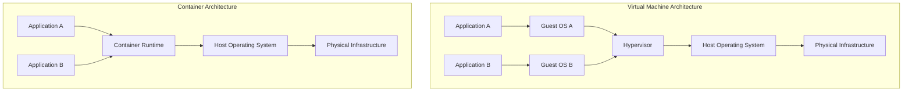

### Benefits of Containerization

- **Consistency**: "Works on my machine" problem solved
- **Resource Efficiency**: Multiple containers on single host
- **Scalability**: Easy horizontal scaling
- **DevOps Integration**: Seamless CI/CD pipeline integration
- **Microservices Ready**: Perfect for microservices architecture

***

## 2. 🛠️ Tools for Containerization

### Docker

**Docker** is the most popular containerization platform with a client-server architecture.[2]

#### Docker Architecture

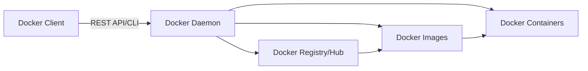

#### Core Docker Components

1. **Docker Client**: Command-line interface (CLI) for user interaction
2. **Docker Daemon**: Background service managing containers, images, and networks[2]
3. **Docker Images**: Read-only templates for creating containers
4. **Docker Containers**: Running instances of Docker images
5. **Docker Registry**: Storage for Docker images (Docker Hub)

#### Essential Docker Commands

```bash
# Pull an image from Docker Hub
docker pull nginx:latest

# List all images
docker images

# Run a container
docker run -d -p 80:80 --name my-nginx nginx:latest

# List running containers
docker ps

# List all containers (including stopped)
docker ps -a

# Stop a container
docker stop my-nginx

# Remove a container
docker rm my-nginx

# View container logs
docker logs my-nginx

# Execute command inside container
docker exec -it my-nginx bash

# Build image from Dockerfile
docker build -t myapp:1.0 .

# Push image to registry
docker push username/myapp:1.0
```

#### Sample Dockerfile

```dockerfile
# Use official Node.js runtime as base image
FROM node:18-alpine

# Set working directory
WORKDIR /app

# Copy package files
COPY package*.json ./

# Install dependencies
RUN npm install

# Copy application code
COPY . .

# Expose port
EXPOSE 3000

# Define environment variable
ENV NODE_ENV=production

# Run application
CMD ["node", "app.js"]
```

### Podman

**Podman** is a daemonless alternative to Docker that provides similar functionality without requiring a background service.

#### Key Differences from Docker

- **Daemonless**: No background daemon required
- **Rootless**: Can run containers without root privileges
- **Pod Support**: Native support for Kubernetes-style pods
- **Docker Compatible**: Uses same command syntax as Docker

#### Podman Commands

```bash
# Commands are nearly identical to Docker
podman pull nginx:latest
podman run -d -p 80:80 --name my-nginx nginx:latest
podman ps
podman stop my-nginx

# Create a pod (unique to Podman)
podman pod create --name mypod -p 8080:80

# Run container in pod
podman run -d --pod mypod nginx
```

### Other Containerization Tools

- **containerd**: Industry-standard container runtime
- **CRI-O**: Lightweight container runtime for Kubernetes
- **LXC/LXD**: System containers (more like lightweight VMs)

***

## 3. 🎯 Overview of Kubernetes

### What is Kubernetes?

**Kubernetes (K8s)** is an open-source container orchestration platform originally developed by Google. It automates the deployment, scaling, and management of containerized applications across clusters of hosts.[3]

### Why Kubernetes?

**Without Kubernetes:**
- Manual container management
- No automatic scaling
- Complex networking setup
- Manual failover and recovery
- Limited resource optimization

**With Kubernetes:**
- ✅ Automated deployment and rollbacks
- ✅ Automatic scaling (horizontal and vertical)
- ✅ Self-healing capabilities
- ✅ Service discovery and load balancing
- ✅ Storage orchestration
- ✅ Secret and configuration management

### Core Kubernetes Features

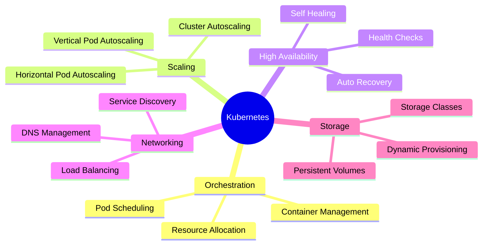

### Kubernetes Ecosystem

- **kubectl**: Command-line tool for interacting with clusters
- **Helm**: Package manager for Kubernetes
- **Operators**: Extend Kubernetes functionality
- **Service Mesh**: Istio, Linkerd for advanced networking
- **Monitoring**: Prometheus, Grafana for observability

***

## 4. 🏗️ Kubernetes Architecture

Kubernetes follows a **master-worker** (control plane-node) architecture.[4]

### High-Level Architecture

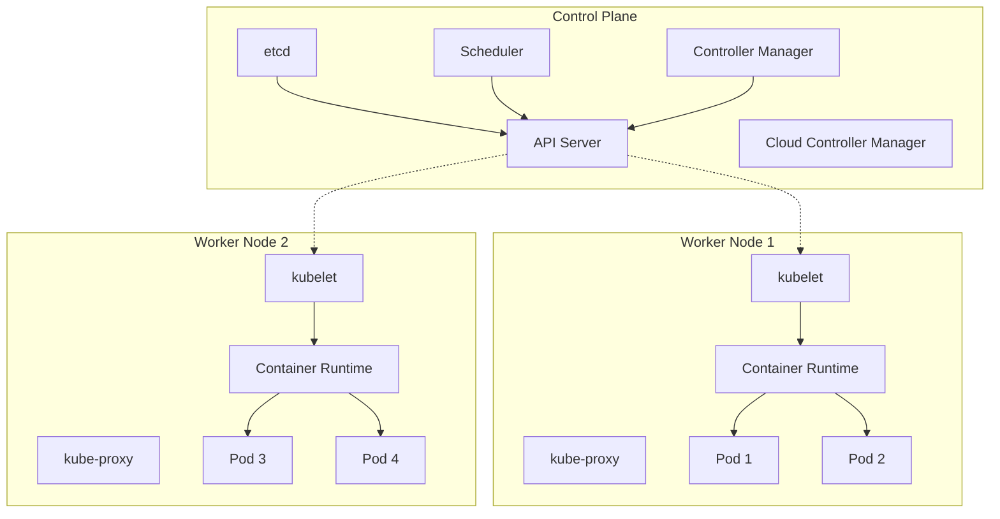

### Control Plane Components

The **control plane** manages the overall state of the cluster.[3][4]

#### 1. **kube-apiserver** 🔌

- Central management entity and primary entry point for all REST commands
- Exposes the Kubernetes HTTP API[3]
- Validates and processes API requests
- Serves as the frontend for the control plane
- All components communicate through the API server

#### 2. **etcd** 💾

- Consistent and highly-available key-value store[3]
- Stores all cluster data including configuration, state, and metadata
- Provides distributed consensus
- Can be restored for disaster recovery
- Critical for cluster state persistence

#### 3. **kube-scheduler** 📅

- Watches for newly created Pods without assigned nodes[3]
- Selects optimal node for each Pod based on:
  - Resource requirements (CPU, memory)
  - Hardware/software constraints
  - Affinity and anti-affinity rules
  - Data locality
  - Workload interference

#### 4. **kube-controller-manager** 🎛️

- Runs controller processes to implement Kubernetes API behavior[3]
- Includes multiple controllers:
  - **Node Controller**: Monitors node health
  - **Replication Controller**: Maintains correct number of pods
  - **Endpoints Controller**: Populates endpoint objects
  - **Service Account Controller**: Creates default accounts

#### 5. **cloud-controller-manager** ☁️ (Optional)

- Integrates with underlying cloud provider APIs[3]
- Manages cloud-specific controllers:
  - Node controller (cloud-based)
  - Route controller
  - Service controller (for load balancers)

### Node (Worker) Components

Nodes are worker machines that run containerized applications.[4]

#### 1. **kubelet** 🤖

- Primary node agent running on each worker node
- Communicates with control plane via API server[4]
- Ensures containers are running in Pods
- Reports node and Pod status
- Executes Pod lifecycle actions

#### 2. **kube-proxy** 🌐

- Network proxy running on each node
- Maintains network rules for Pod communication
- Implements Kubernetes Service abstraction
- Handles load balancing for Services
- Manages iptables/IPVS rules

#### 3. **Container Runtime** 🏃

- Software responsible for running containers
- Supported runtimes:
  - **containerd** (most common)
  - **CRI-O**
  - **Docker Engine** (deprecated but still used)

### Complete Architecture Flow

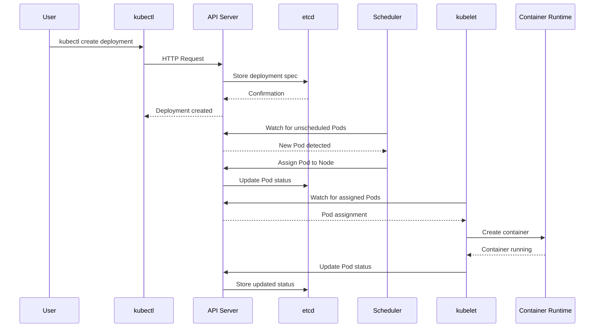

***

## 5. 📦 Kubernetes Objects

Kubernetes objects are persistent entities that represent the desired state of your cluster.

### Pods

**Pods** are the smallest deployable units in Kubernetes. A Pod represents a single instance of a running process and can contain one or more containers.[3]

#### Pod Characteristics

- Containers in a Pod share network namespace (same IP)
- Share storage volumes
- Co-located and co-scheduled
- Run in a shared context

#### Single Container Pod Example

```yaml
apiVersion: v1
kind: Pod
metadata:
  name: nginx-pod
  labels:
    app: nginx
    environment: production
spec:
  containers:
  - name: nginx
    image: nginx:1.21
    ports:
    - containerPort: 80
    resources:
      requests:
        memory: "64Mi"
        cpu: "250m"
      limits:
        memory: "128Mi"
        cpu: "500m"
```

#### Multi-Container Pod Example

```yaml
apiVersion: v1
kind: Pod
metadata:
  name: multi-container-pod
spec:
  containers:
  - name: nginx
    image: nginx:latest
    ports:
    - containerPort: 80
    volumeMounts:
    - name: shared-data
      mountPath: /usr/share/nginx/html
      
  - name: log-sidecar
    image: busybox
    command: ['sh', '-c', 'tail -f /var/log/nginx/access.log']
    volumeMounts:
    - name: shared-data
      mountPath: /var/log/nginx
      
  volumes:
  - name: shared-data
    emptyDir: {}
```

#### Create and Manage Pods

```bash
# Create Pod from YAML
kubectl apply -f nginx-pod.yaml

# List all Pods
kubectl get pods

# Detailed Pod information
kubectl describe pod nginx-pod

# View Pod logs
kubectl logs nginx-pod

# Execute command in Pod
kubectl exec -it nginx-pod -- /bin/bash

# Delete Pod
kubectl delete pod nginx-pod
```

### ReplicaSets

**ReplicaSets** ensure a specified number of Pod replicas are running at any given time.

#### ReplicaSet Architecture

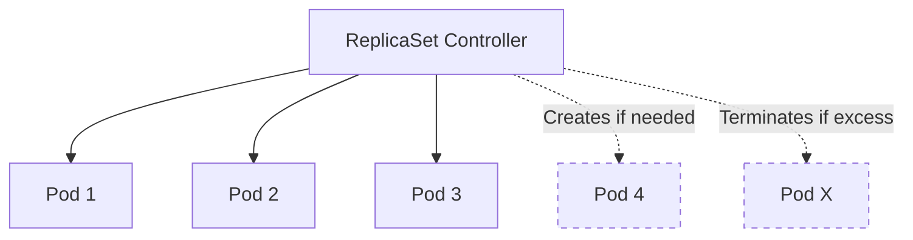

#### ReplicaSet Example

```yaml
apiVersion: apps/v1
kind: ReplicaSet
metadata:
  name: nginx-replicaset
  labels:
    app: nginx
spec:
  replicas: 3
  selector:
    matchLabels:
      app: nginx
      tier: frontend
  template:
    metadata:
      labels:
        app: nginx
        tier: frontend
    spec:
      containers:
      - name: nginx
        image: nginx:1.21
        ports:
        - containerPort: 80
```

#### ReplicaSet Operations

```bash
# Create ReplicaSet
kubectl apply -f nginx-replicaset.yaml

# List ReplicaSets
kubectl get replicasets
kubectl get rs

# Scale ReplicaSet
kubectl scale replicaset nginx-replicaset --replicas=5

# Delete ReplicaSet
kubectl delete replicaset nginx-replicaset
```

### Deployments

**Deployments** provide declarative updates for Pods and ReplicaSets with rollback capabilities.

#### Deployment Features

- Rolling updates
- Rollback to previous versions
- Pause and resume deployments
- Version history tracking

#### Deployment Lifecycle

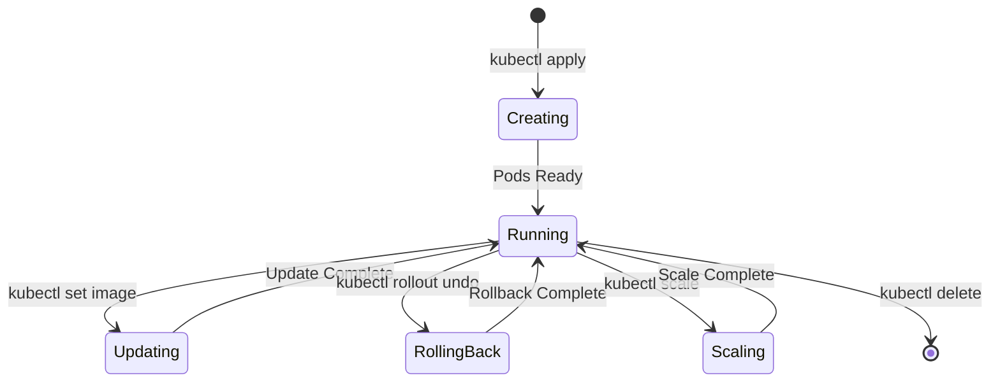

#### Deployment Example

```yaml
apiVersion: apps/v1
kind: Deployment
metadata:
  name: nginx-deployment
  labels:
    app: nginx
spec:
  replicas: 3
  strategy:
    type: RollingUpdate
    rollingUpdate:
      maxSurge: 1
      maxUnavailable: 1
  selector:
    matchLabels:
      app: nginx
  template:
    metadata:
      labels:
        app: nginx
    spec:
      containers:
      - name: nginx
        image: nginx:1.21
        ports:
        - containerPort: 80
        livenessProbe:
          httpGet:
            path: /
            port: 80
          initialDelaySeconds: 30
          periodSeconds: 10
        readinessProbe:
          httpGet:
            path: /
            port: 80
          initialDelaySeconds: 5
          periodSeconds: 5
```

#### Deployment Management

```bash
# Create Deployment
kubectl apply -f nginx-deployment.yaml

# View Deployments
kubectl get deployments

# Detailed deployment info
kubectl describe deployment nginx-deployment

# Update image (triggers rolling update)
kubectl set image deployment/nginx-deployment nginx=nginx:1.22

# Check rollout status
kubectl rollout status deployment/nginx-deployment

# View rollout history
kubectl rollout history deployment/nginx-deployment

# Rollback to previous version
kubectl rollout undo deployment/nginx-deployment

# Rollback to specific revision
kubectl rollout undo deployment/nginx-deployment --to-revision=2

# Scale deployment
kubectl scale deployment nginx-deployment --replicas=5

# Pause deployment
kubectl rollout pause deployment/nginx-deployment

# Resume deployment
kubectl rollout resume deployment/nginx-deployment
```

### Namespaces

**Namespaces** provide logical isolation and resource partitioning within a cluster.

#### Default Namespaces

- **default**: Default namespace for objects without specified namespace
- **kube-system**: Kubernetes system components
- **kube-public**: Publicly accessible resources
- **kube-node-lease**: Node heartbeat objects

#### Namespace Visualization

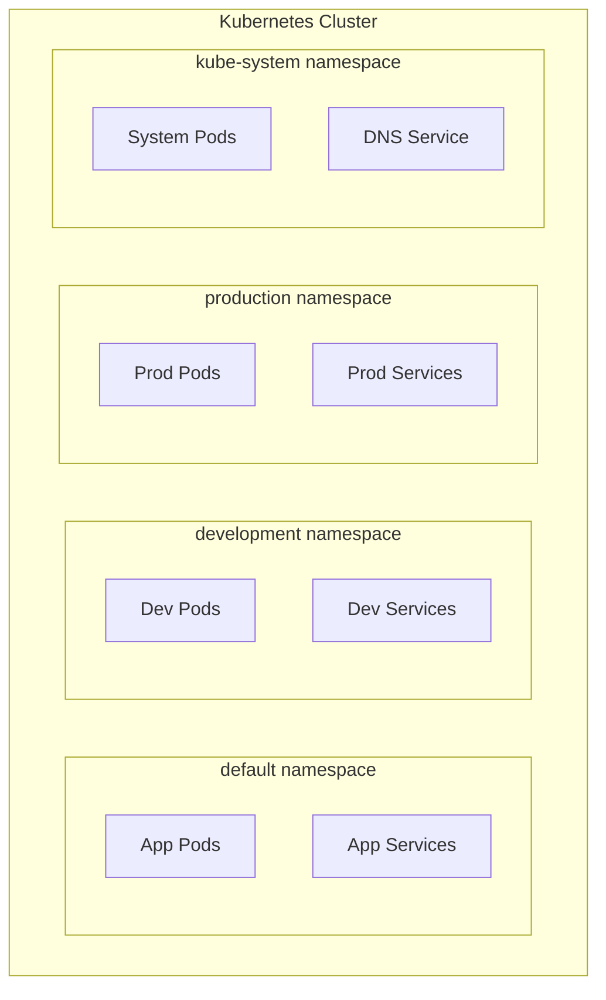

#### Create and Use Namespaces

```yaml
# namespace.yaml
apiVersion: v1
kind: Namespace
metadata:
  name: development
  labels:
    environment: dev
```

```bash
# Create namespace imperatively
kubectl create namespace production

# Create from YAML
kubectl apply -f namespace.yaml

# List namespaces
kubectl get namespaces
kubectl get ns

# Create resources in specific namespace
kubectl apply -f app.yaml --namespace=development
kubectl apply -f app.yaml -n development

# Set default namespace for current context
kubectl config set-context --current --namespace=development

# View resources in namespace
kubectl get pods -n production

# View resources in all namespaces
kubectl get pods --all-namespaces
kubectl get pods -A

# Delete namespace (deletes all resources within)
kubectl delete namespace development
```

#### Namespace with Resource Quotas

```yaml
apiVersion: v1
kind: ResourceQuota
metadata:
  name: dev-quota
  namespace: development
spec:
  hard:
    requests.cpu: "4"
    requests.memory: 8Gi
    limits.cpu: "8"
    limits.memory: 16Gi
    pods: "10"
    services: "5"
```

***

## 6. ⚙️ Kubernetes Setup Tools

### kubeadm

**kubeadm** is an official tool for bootstrapping production-grade Kubernetes clusters.[5]

#### Key Features

- Creates minimum viable cluster
- Follows best practices
- Supports multi-node clusters
- Certificate management
- Control plane upgrades

#### Requirements

- 2 GB RAM per node
- 2 CPUs per node
- Network connectivity between nodes
- Unique hostname, MAC address, product_uuid

#### Basic kubeadm Workflow

```bash
# Initialize control plane (on master node)
sudo kubeadm init --pod-network-cidr=10.244.0.0/16

# Set up kubectl for current user
mkdir -p $HOME/.kube
sudo cp -i /etc/kubernetes/admin.conf $HOME/.kube/config
sudo chown $(id -u):$(id -g) $HOME/.kube/config

# Install pod network (e.g., Calico)
kubectl apply -f https://docs.projectcalico.org/manifests/calico.yaml

# Join worker nodes (run on worker nodes)
sudo kubeadm join <master-ip>:6443 --token <token> \
    --discovery-token-ca-cert-hash sha256:<hash>
```

### Minikube

**Minikube** creates a single-node Kubernetes cluster on your local machine for development and testing.[5]

#### Key Features

- Easy setup with minimal configuration[5]
- Runs on various platforms (Linux, macOS, Windows)
- Multiple driver support (Docker, VirtualBox, KVM)
- Add-ons for common tools
- Resource-efficient for development

#### Requirements

- 2 CPUs minimum[5]
- 2 GB RAM minimum[5]
- 20 GB disk space
- Container or VM driver

#### Minikube Drivers

- **Docker** (recommended)
- **VirtualBox**
- **KVM**
- **Hyper-V** (Windows)
- **Podman**

***

## 7. 🚀 Setting up Kubernetes with Minikube

### Installation

#### Linux

```bash
# Download Minikube binary
curl -LO https://storage.googleapis.com/minikube/releases/latest/minikube-linux-amd64

# Install Minikube
sudo install minikube-linux-amd64 /usr/local/bin/minikube

# Verify installation
minikube version
```

#### macOS

```bash
# Using Homebrew
brew install minikube

# Verify installation
minikube version
```

#### Windows

```powershell
# Using Chocolatey
choco install minikube

# Using Windows Installer
# Download from https://minikube.sigs.k8s.io/docs/start/
```

### Starting Minikube

```bash
# Start with default settings (2 CPUs, 2GB RAM)
minikube start

# Start with custom resources
minikube start --cpus=4 --memory=8192

# Start with specific driver
minikube start --driver=docker

# Start with specific Kubernetes version
minikube start --kubernetes-version=v1.28.0

# Check status
minikube status
```

### Minikube Configuration

```bash
# View Minikube configuration
minikube config view

# Set default driver
minikube config set driver docker

# Set default resources
minikube config set cpus 4
minikube config set memory 8192
```

### Managing Minikube Cluster

```bash
# Stop cluster
minikube stop

# Delete cluster
minikube delete

# Pause cluster (saves resources)
minikube pause

# Unpause cluster
minikube unpause

# SSH into Minikube VM
minikube ssh

# View cluster IP
minikube ip

# Open Kubernetes dashboard
minikube dashboard
```

### Minikube Add-ons

```bash
# List available add-ons
minikube addons list

# Enable add-on
minikube addons enable dashboard
minikube addons enable metrics-server
minikube addons enable ingress

# Disable add-on
minikube addons disable dashboard

# View enabled add-ons
minikube addons list | grep enabled
```

### Deploy Sample Application on Minikube

```bash
# Create deployment
kubectl create deployment hello-minikube --image=kicbase/echo-server:1.0

# Expose deployment as service
kubectl expose deployment hello-minikube --type=NodePort --port=8080

# Get service URL
minikube service hello-minikube --url

# Open service in browser
minikube service hello-minikube

# View all resources
kubectl get all
```

### Complete Example: Deploy Nginx on Minikube

```yaml
# nginx-minikube.yaml
apiVersion: apps/v1
kind: Deployment
metadata:
  name: nginx-deployment
spec:
  replicas: 2
  selector:
    matchLabels:
      app: nginx
  template:
    metadata:
      labels:
        app: nginx
    spec:
      containers:
      - name: nginx
        image: nginx:latest
        ports:
        - containerPort: 80
---
apiVersion: v1
kind: Service
metadata:
  name: nginx-service
spec:
  type: NodePort
  selector:
    app: nginx
  ports:
  - protocol: TCP
    port: 80
    targetPort: 80
```

```bash
# Start Minikube
minikube start

# Apply configuration
kubectl apply -f nginx-minikube.yaml

# Verify deployment
kubectl get deployments
kubectl get pods
kubectl get services

# Access the service
minikube service nginx-service

# Get service URL
minikube service nginx-service --url

# Clean up
kubectl delete -f nginx-minikube.yaml

# Stop Minikube
minikube stop
```

***

## 8. ☁️ Amazon EKS (Elastic Kubernetes Service)

### What is Amazon EKS?

**Amazon EKS** is a fully managed Kubernetes service that makes it easy to run Kubernetes on AWS without needing to install and operate your own control plane.[5]

### EKS Architecture

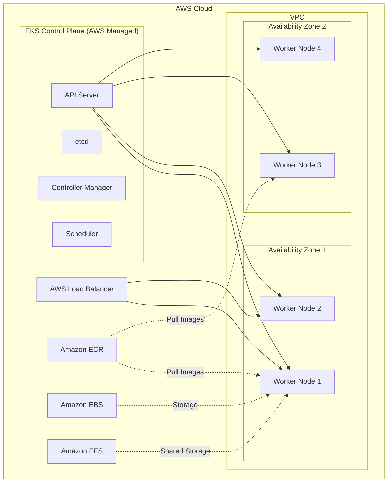

### EKS Key Features

- **Fully Managed Control Plane**: AWS manages API server, etcd, scheduler[5]
- **High Availability**: Control plane runs across multiple AZs
- **Automatic Upgrades**: Managed Kubernetes version updates
- **AWS Integration**: Native integration with AWS services
- **Security**: IAM authentication, VPC isolation
- **Scalability**: Auto-scaling with Cluster Autoscaler

### EKS Components

#### Control Plane (Managed by AWS)
- Runs in AWS-managed account
- Distributed across multiple AZs
- Automatic backups and patches
- No direct access to control plane nodes

#### Data Plane (Your AWS Account)
- Worker nodes run in your VPC
- Can use EC2 instances or AWS Fargate
- You manage node scaling and updates

### Prerequisites for EKS

```bash
# Install AWS CLI
curl "https://awscli.amazonaws.com/awscli-exe-linux-x86_64.zip" -o "awscliv2.zip"
unzip awscliv2.zip
sudo ./aws/install

# Configure AWS credentials
aws configure

# Install eksctl (EKS management tool)
curl --silent --location "https://github.com/weaveworks/eksctl/releases/latest/download/eksctl_$(uname -s)_amd64.tar.gz" | tar xz -C /tmp
sudo mv /tmp/eksctl /usr/local/bin

# Verify installation
eksctl version

# Install kubectl
curl -LO "https://dl.k8s.io/release/$(curl -L -s https://dl.k8s.io/release/stable.txt)/bin/linux/amd64/kubectl"
sudo install -o root -g root -m 0755 kubectl /usr/local/bin/kubectl
kubectl version --client
```

### Creating EKS Cluster

#### Using eksctl (Recommended)

```bash
# Create basic cluster
eksctl create cluster \
  --name my-eks-cluster \
  --region us-west-2 \
  --nodegroup-name standard-workers \
  --node-type t3.medium \
  --nodes 3 \
  --nodes-min 1 \
  --nodes-max 4

# Create cluster with configuration file
# cluster-config.yaml
cat <<EOF > cluster-config.yaml
apiVersion: eksctl.io/v1alpha5
kind: ClusterConfig

metadata:
  name: production-eks
  region: us-west-2
  version: "1.28"

managedNodeGroups:
  - name: ng-1
    instanceType: t3.medium
    desiredCapacity: 3
    minSize: 1
    maxSize: 5
    volumeSize: 20
    ssh:
      allow: true
    labels:
      role: worker
    tags:
      environment: production

iam:
  withOIDC: true
EOF

# Create cluster from config
eksctl create cluster -f cluster-config.yaml

# Update kubeconfig
aws eks update-kubeconfig --region us-west-2 --name my-eks-cluster

# Verify connection
kubectl get nodes
kubectl get pods --all-namespaces
```

#### Using AWS Console

1. Navigate to EKS in AWS Console
2. Click "Create cluster"
3. Configure cluster settings:
   - Cluster name
   - Kubernetes version
   - Cluster service role
4. Configure networking:
   - VPC
   - Subnets
   - Security groups
5. Configure logging (optional)
6. Review and create

### EKS Node Groups

```bash
# Create managed node group
eksctl create nodegroup \
  --cluster=my-eks-cluster \
  --region=us-west-2 \
  --name=ng-2 \
  --node-type=t3.large \
  --nodes=3 \
  --nodes-min=1 \
  --nodes-max=5

# List node groups
eksctl get nodegroup --cluster=my-eks-cluster

# Scale node group
eksctl scale nodegroup \
  --cluster=my-eks-cluster \
  --name=ng-1 \
  --nodes=5

# Delete node group
eksctl delete nodegroup \
  --cluster=my-eks-cluster \
  --name=ng-2
```

### Deploy Application on EKS

```yaml
# app-deployment.yaml
apiVersion: apps/v1
kind: Deployment
metadata:
  name: nginx-eks
spec:
  replicas: 3
  selector:
    matchLabels:
      app: nginx
  template:
    metadata:
      labels:
        app: nginx
    spec:
      containers:
      - name: nginx
        image: nginx:latest
        ports:
        - containerPort: 80
---
apiVersion: v1
kind: Service
metadata:
  name: nginx-service
spec:
  type: LoadBalancer
  selector:
    app: nginx
  ports:
  - protocol: TCP
    port: 80
    targetPort: 80
```

```bash
# Deploy application
kubectl apply -f app-deployment.yaml

# Get service (LoadBalancer URL)
kubectl get service nginx-service

# Access application
# Use EXTERNAL-IP from previous command in browser
```

### EKS Cluster Management

```bash
# View cluster info
eksctl get cluster

# Update cluster
eksctl upgrade cluster --name=my-eks-cluster --approve

# Delete cluster (and all resources)
eksctl delete cluster --name=my-eks-cluster --region=us-west-2
```

### EKS Cost Optimization

- **Control Plane**: $0.10 per hour (AWS managed)
- **Worker Nodes**: Standard EC2 pricing
- **Data Transfer**: Standard AWS data transfer rates
- **Use Spot Instances**: For non-critical workloads
- **Right-size nodes**: Choose appropriate instance types

***

## 9. 🔄 Comparison: kubeadm vs Minikube vs EKS

### Comprehensive Comparison Table

| Feature | Minikube | kubeadm | Amazon EKS |
|---------|----------|---------|------------|
| **Purpose** | Local development and testing [5] | Tool for bootstrapping Kubernetes clusters [5] | Fully managed production Kubernetes [5] |
| **Setup Complexity** | Easy, minimal configuration [5] | Moderate, requires manual setup [5] | Very easy, managed by AWS [5] |
| **Best For** | Learning, local development | On-premises, self-managed clusters | Production workloads on AWS |
| **Cluster Type** | Single-node | Multi-node | Multi-node (managed) |
| **Control Plane** | Bundled with node | Self-managed | AWS-managed |
| **High Availability** | No | Manual setup required | Built-in (multi-AZ) |
| **Resource Requirements** | 2 CPU, 2GB RAM minimum [5] | 2GB RAM, 2 CPU per node [5] | Based on node selection |
| **Operating System** | Linux, macOS, Windows | Linux only | AWS-managed |
| **Networking** | Built-in | Manual configuration | AWS VPC integration |
| **Storage** | hostPath, local volumes | Manual setup | AWS EBS, EFS integration |
| **Load Balancing** | NodePort, Ingress | Manual setup | AWS ELB/ALB/NLB |
| **Monitoring** | Add-ons available | Manual setup | CloudWatch integration |
| **Upgrades** | Simple commands | Manual process | Managed by AWS |
| **Cost** | Free (local resources) | Infrastructure cost only | $0.10/hr + node costs |
| **Scalability** | Limited to single node | Manual scaling | Auto-scaling support |
| **Production Ready** | ❌ No | ✅ Yes (with setup) | ✅ Yes |
| **Cloud Integration** | Limited | Manual | Native AWS services |
| **Backup/Recovery** | Manual | Manual | AWS snapshots |
| **Security** | Basic | Self-configured | IAM, Security Groups |

### Use Case Recommendations

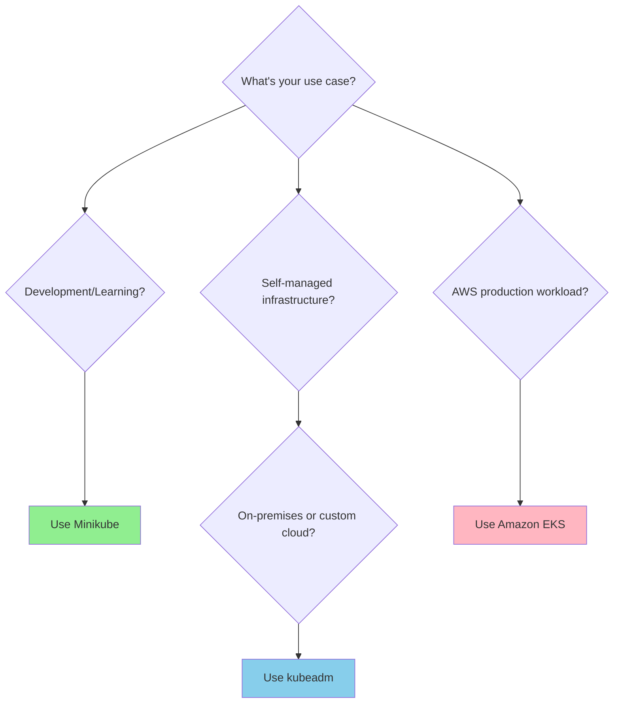

### When to Use Each Tool

#### ✅ Use Minikube When:
- Learning Kubernetes concepts
- Developing applications locally
- Testing configurations before deployment
- Quick prototyping
- Resource-constrained environments
- No cloud infrastructure required

#### ✅ Use kubeadm When:
- Setting up on-premises clusters
- Full control over cluster configuration
- Custom networking requirements
- Specific compliance requirements
- Deploying to bare metal servers
- Multi-cloud strategies
- Educational institutions (hands-on learning)

#### ✅ Use Amazon EKS When:
- Production workloads on AWS
- Need high availability automatically
- Want managed control plane
- Require AWS service integration
- Prefer hands-off cluster management
- Need enterprise-grade security
- Scaling production applications
- Team lacks Kubernetes expertise

***

## 10. 🏭 Use of Kubernetes in Industry

### Industry Adoption

Kubernetes has become the de facto standard for container orchestration across industries.

### Real-World Use Cases

#### 1. **E-Commerce Platforms** 🛒

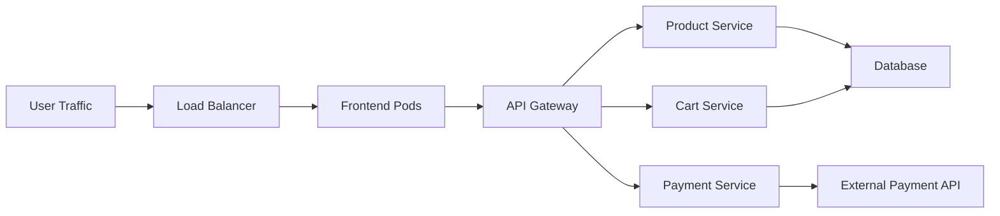

**Benefits:**
- Handle traffic spikes during sales
- Auto-scale services independently
- Zero-downtime deployments
- Microservices architecture

**Companies:** Amazon, eBay, Shopify

#### 2. **Financial Services** 💰

**Use Cases:**
- Real-time transaction processing
- Fraud detection systems
- Trading platforms
- Customer portals

**Benefits:**
- High availability (99.99% uptime)
- Security and compliance
- Data isolation with namespaces
- Audit logging

**Companies:** Capital One, ING Bank, Goldman Sachs

#### 3. **Media and Entertainment** 🎬

**Use Cases:**
- Video streaming platforms
- Content delivery
- Real-time analytics
- User recommendation engines

**Benefits:**
- Global content distribution
- Dynamic scaling for viewership
- Cost optimization
- Multi-region deployments

**Companies:** Spotify, Netflix (parts of infrastructure), BBC

#### 4. **Healthcare** 🏥

**Use Cases:**
- Patient data management
- Medical imaging processing
- Telemedicine platforms
- Research computing

**Benefits:**
- HIPAA compliance
- Secure data handling
- Scalable processing
- Disaster recovery

#### 5. **Telecommunications** 📱

**Use Cases:**
- 5G network functions
- Edge computing
- Network monitoring
- Customer applications

**Benefits:**
- Network function virtualization (NFV)
- Edge deployments
- Low latency
- Service orchestration

**Companies:** AT&T, Verizon, T-Mobile

### Popular Kubernetes Deployment Patterns

#### Microservices Architecture

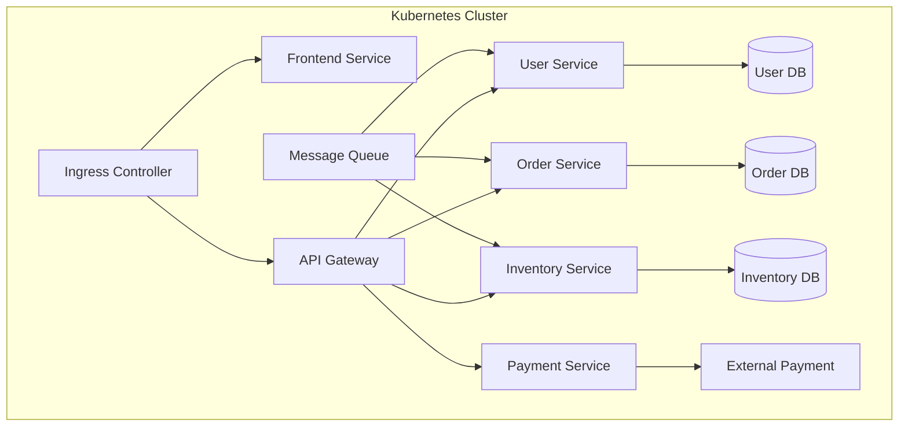

#### CI/CD Pipeline Integration

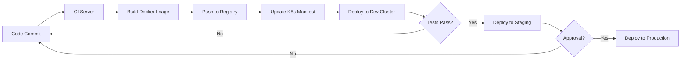

### Industry-Specific Benefits

| Industry | Key Benefit | Example |
|----------|-------------|---------|
| E-commerce | Elastic scaling during sales | Black Friday traffic handling |
| Finance | Security & compliance | PCI DSS compliant deployments |
| Healthcare | Data isolation | HIPAA-compliant patient data |
| Gaming | Global distribution | Low-latency game servers |
| SaaS | Multi-tenancy | Isolated customer environments |
| IoT | Edge computing | Process data close to devices |

### Kubernetes Success Stories

#### Spotify
- **Challenge**: Manage microservices at scale
- **Solution**: Deployed over 200 services on Kubernetes
- **Result**: Faster deployments, better resource utilization

#### Airbnb
- **Challenge**: Migrate from monolith to microservices
- **Solution**: Kubernetes-based microservices platform
- **Result**: 1000+ microservices, improved developer productivity

#### The New York Times
- **Challenge**: Modernize legacy infrastructure
- **Solution**: Cloud-native architecture on Kubernetes
- **Result**: Faster feature delivery, reduced infrastructure costs

### Enterprise Kubernetes Trends

1. **Multi-Cloud Deployments**: Running workloads across AWS, Azure, GCP
2. **Edge Computing**: Kubernetes on edge devices
3. **AI/ML Workloads**: Training and serving models
4. **GitOps**: Infrastructure as Code with Kubernetes
5. **Service Mesh**: Advanced traffic management (Istio, Linkerd)
6. **Serverless**: Knative for serverless on Kubernetes
7. **Security**: Zero-trust architectures, policy enforcement

### Job Roles Using Kubernetes

- **DevOps Engineer**: Cluster management, CI/CD
- **Site Reliability Engineer (SRE)**: Production operations
- **Cloud Engineer**: Cloud infrastructure management
- **Platform Engineer**: Internal developer platforms
- **Security Engineer**: Container security, policy enforcement
- **Solutions Architect**: Design K8s-based solutions

### Skills in Demand

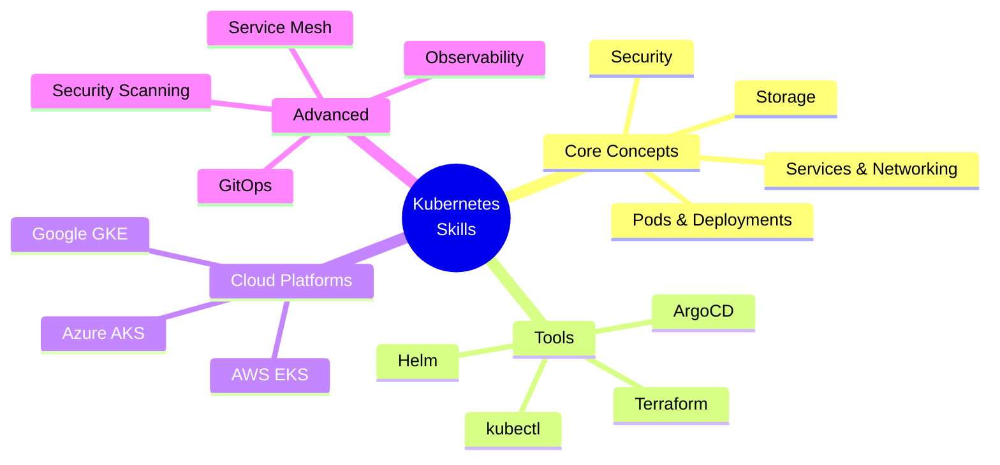

***

## 📝 Summary Checklist

By completing this unit, you should be able to:

- ✅ Explain containerization concepts and benefits
- ✅ Use Docker and Podman for container management
- ✅ Understand Kubernetes architecture (control plane and nodes)
- ✅ Work with Pods, ReplicaSets, Deployments, and Namespaces
- ✅ Set up Kubernetes using Minikube
- ✅ Understand kubeadm for cluster bootstrapping
- ✅ Deploy and manage applications on Amazon EKS
- ✅ Compare different Kubernetes setup tools
- ✅ Recognize industry use cases for Kubernetes

***

## 🔗 Additional Resources

### Official Documentation
- [Kubernetes Documentation](https://kubernetes.io/docs/)
- [Docker Documentation](https://docs.docker.com/)
- [Amazon EKS Documentation](https://docs.aws.amazon.com/eks/)
- [Minikube Documentation](https://minikube.sigs.k8s.io/docs/)

### Practice Labs
- [Kubernetes Playground](https://labs.play-with-k8s.com/)
- [Katacoda Kubernetes Scenarios](https://www.katacoda.com/courses/kubernetes)

### Community
- [Kubernetes Slack](https://slack.k8s.io/)
- [CNCF Community](https://www.cncf.io/community/)

***

## 💡 Quick Reference Commands

```bash
# Docker basics
docker run -d -p 8080:80 nginx
docker ps
docker logs <container-id>
docker exec -it <container-id> bash

# kubectl basics
kubectl get pods
kubectl get deployments
kubectl get services
kubectl describe pod <pod-name>
kubectl logs <pod-name>
kubectl exec -it <pod-name> -- bash

# Minikube
minikube start
minikube status
minikube dashboard
minikube service <service-name>

# EKS with eksctl
eksctl create cluster --name=my-cluster
eksctl get cluster
eksctl delete cluster --name=my-cluster
```

***

**🎉 End of Unit 1: Introduction to Kubernetes and Containerization**

This comprehensive guide covers all topics from your syllabus with detailed explanations, practical examples, diagrams, and real-world context. The content follows the chronological order specified in your course outline and includes code examples for hands-on practice.[6]

[1](https://www.incredibuild.com/blog/docker-101-a-comprehensive-tutorial-for-beginners)
[2](https://www.geeksforgeeks.org/blogs/containerization-using-docker/)
[3](https://kubernetes.io/docs/concepts/overview/components/)
[4](https://spot.io/resources/kubernetes-architecture/11-core-components-explained/)
[5](https://k21academy.com/kubernetes/kubernetes-installation-options/)
[6](https://ppl-ai-file-upload.s3.amazonaws.com/web/direct-files/attachments/86544428/15a00330-f476-44d5-aea7-b3525b13714a/INT334_New.pdf)
[7](https://kubernetes.io/docs/concepts/architecture/)
[8](https://devopscube.com/kubernetes-architecture-explained/)
[9](https://thinksys.com/devops/understanding-kubernetes-architecture/)
[10](https://devtron.ai/blog/kubernetes-architecture-the-ultimate-guide/)
[11](https://cloud.theodo.com/en/blog/minikube-kubeadm-kind-k3s)
