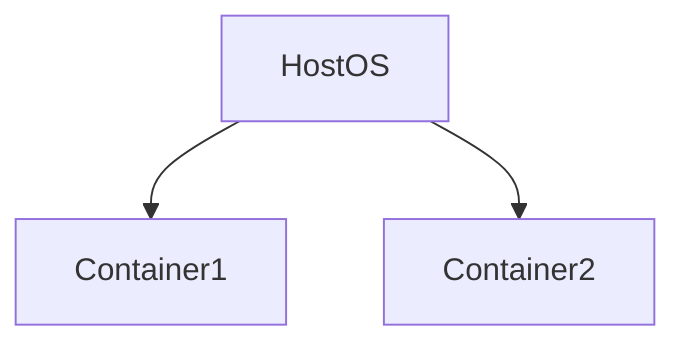
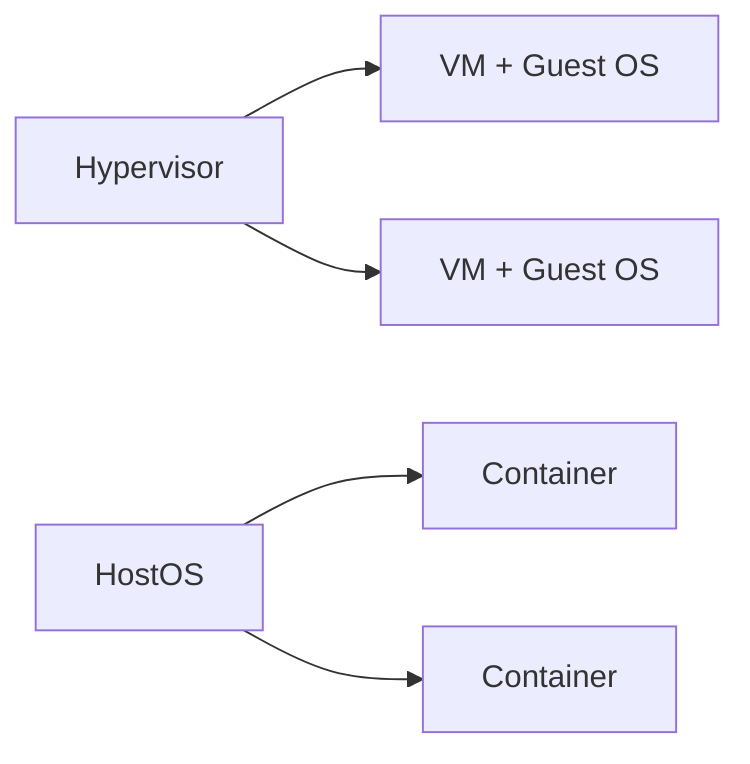
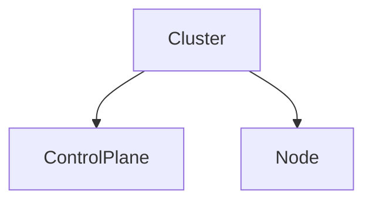
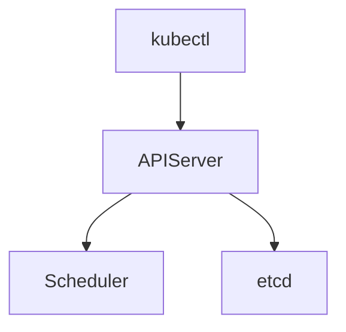
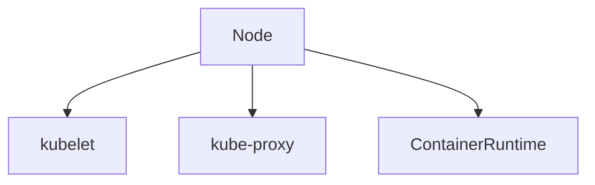
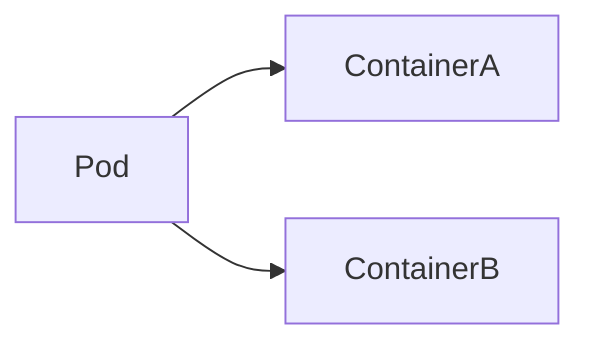
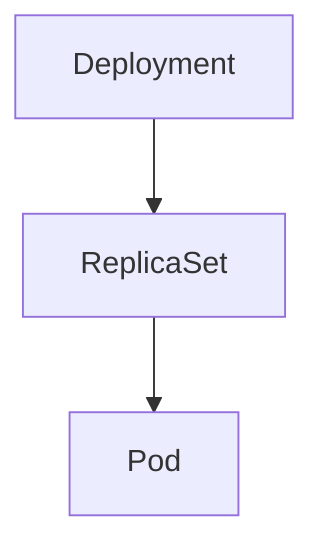
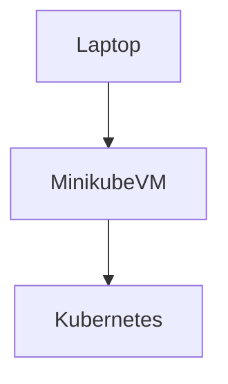

# 🎓 Kubernetes – UNIT I (Ultra-Detailed Beginner Guide)

> **Unit Focus:** Concepts → Architecture → Objects → Tools → Platforms → Industry Use
> **Teaching Style:** Explain *what & why first*, then *how*
> **Target Audience:** Absolute beginners, undergraduate students, FDP participants

---

## 🔰 1. Introduction: Why Containerization & Kubernetes?

### Traditional Application Deployment (Before Containers)

* Applications installed directly on OS
* Dependency conflicts ❌
* Works on my machine problem ❌
* Hard to scale ❌

---

## 📦 2. Containerization Concepts

### ❓ What is Containerization?

**Containerization** is a method of packaging an application **along with its dependencies, libraries, and configuration** so that it runs **consistently across environments**.

👉 A container is **lightweight**, **portable**, and **isolated**.

---

### 🧠 How Containers Work (Conceptually)

* Containers share the **host OS kernel**
* Each container has its own:

  * filesystem
  * network
  * process space

---

### 🆚 Virtual Machines vs Containers

| Virtual Machine     | Container      |
| ------------------- | -------------- |
| Full Guest OS       | Shares Host OS |
| Heavy               | Lightweight    |
| Slow startup        | Fast startup   |
| High resource usage | Efficient      |

---

## 🛠️ 3. Tools for Containerization

### 🐳 Docker

**Docker** is the most popular containerization platform.

Key features:

* Docker Engine
* Dockerfile
* Docker Images & Containers
* Docker Hub

👉 Docker made containers mainstream.

---

### 🦭 Podman

**Podman** is a daemonless container engine.

Key features:

* No background daemon
* Rootless containers
* Docker-compatible CLI

---

### 📊 Docker vs Podman

| Feature             | Docker  | Podman |
| ------------------- | ------- | ------ |
| Daemon              | Yes     | No     |
| Rootless            | Limited | Yes    |
| Production Ready    | Yes     | Yes    |
| Kubernetes Friendly | Yes     | Yes    |

---

## ☸️ 4. Overview of Kubernetes

### ❓ What is Kubernetes?

**Kubernetes (K8s)** is an **open-source container orchestration platform**.

It automates:

* Deployment
* Scaling
* Load balancing
* Self-healing

👉 Kubernetes does **not replace Docker**, it **manages Docker containers**.

---

## 🧠 5. Kubernetes Core Components (High-Level)

* **Cluster** → Entire Kubernetes system
* **Control Plane** → Brain 🧠
* **Node** → Worker machine 💪

---

## 🏗️ 6. Kubernetes Architecture (Detailed)

### 🧠 Control Plane Components

| Component          | Role                           |
| ------------------ | ------------------------------ |
| API Server         | Entry point for all operations |
| Scheduler          | Assigns pods to nodes          |
| Controller Manager | Maintains desired state        |
| etcd               | Cluster state database         |

---

### 💪 Node Components

| Component         | Role                            |
| ----------------- | ------------------------------- |
| kubelet           | Communicates with control plane |
| kube-proxy        | Networking & service routing    |
| Container Runtime | Runs containers                 |

---

## 🧱 7. Kubernetes Objects (Conceptual Understanding)

### 📦 Pod

* Smallest deployable unit in Kubernetes
* Wraps one or more containers
* Shares IP and storage

---

### 🔁 ReplicaSet

* Ensures a fixed number of Pods are running
* Recreates Pods if they fail

---

### 🚀 Deployment

* Manages ReplicaSets
* Supports rolling updates and rollback

---

### 🗂️ Namespace

* Logical isolation inside a cluster
* Used for multi-team environments

Examples:

* default
* kube-system
* dev / prod

---

## 🧰 8. Introduction to kubeadm and Minikube

### 🔧 kubeadm

* Tool to create **production-grade Kubernetes clusters**
* Used on real servers
* Requires Linux machines

---

### 🧪 Minikube

* Local Kubernetes cluster
* Ideal for learning & testing
* Runs in VM or container

---

### 📊 kubeadm vs Minikube

| Feature          | kubeadm | Minikube  |
| ---------------- | ------- | --------- |
| Learning         | Medium  | Excellent |
| Production       | Yes     | No        |
| Setup Complexity | High    | Low       |

---

## ⚙️ 9. Setting up Kubernetes using Minikube (Concept → Practice)

### What Minikube Does Internally

* Creates a VM
* Installs Kubernetes components
* Configures kubectl automatically

---

### (Practical commands will be covered in Unit II)

👉 **In Unit I**, focus is on **understanding**, not heavy practice.

---

## ☁️ 10. Introduction to Amazon EKS (Elastic Kubernetes Service)

**Amazon EKS** is a **managed Kubernetes service** by AWS.

AWS manages:

* Control Plane
* Security patches
* High availability

User manages:

* Worker nodes
* Applications

---

## ⚖️ 11. Comparing kubeadm, Minikube and Amazon EKS

| Feature     | Minikube | kubeadm         | EKS       |
| ----------- | -------- | --------------- | --------- |
| Environment | Local    | On-Prem / Cloud | AWS Cloud |
| Managed     | No       | No              | Yes       |
| Production  | No       | Yes             | Yes       |

---

## 🏭 12. Use of Kubernetes in Industry

Kubernetes is widely used for:

* Microservices architecture
* CI/CD pipelines
* Cloud-native applications
* High availability systems

### Industry Examples

* Netflix → streaming services
* Amazon → scalable backend services
* Airbnb → microservices deployment
* EdTech / FinTech / SaaS platforms

---

## 🧠 UNIT I – Key Takeaways

* Containers solve dependency issues
* Docker/Podman create containers
* Kubernetes manages containers
* Pods run containers
* Minikube = learning
* kubeadm = production
* EKS = managed Kubernetes

---

## 📘 Transition to Unit II

👉 **Unit II will focus on:**

* Actual cluster setup
* YAML-based deployments
* RBAC, ConfigMaps & Secrets

---

✅ **End of UNIT I – Concepts Fully Covered**
