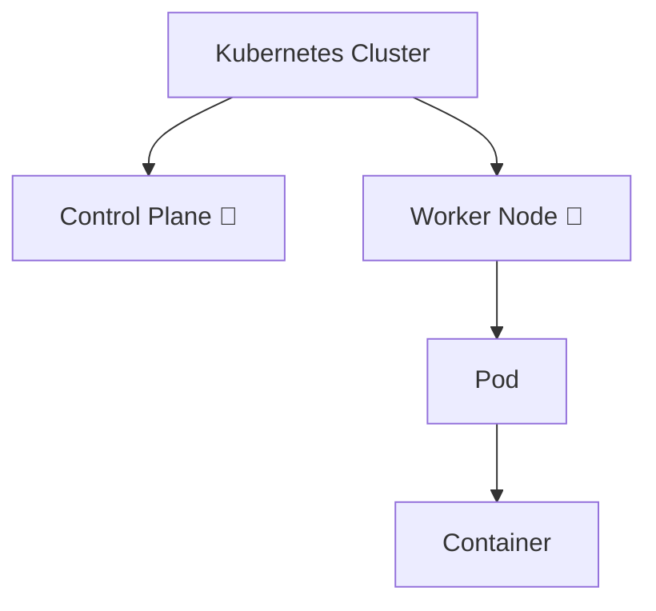
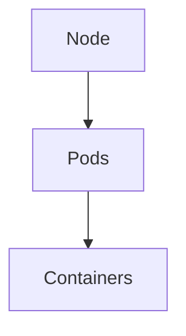
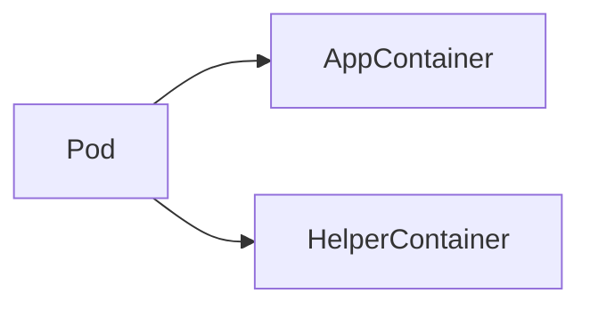
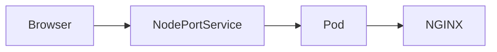

# 🎓 Kubernetes – COMPLETE Beginner Training Material (Windows 11)

> **Designed for:** Classroom training, workshops, FDPs, self-study
> **Audience:** Absolute beginners (no Kubernetes background)
> **Outcome:** Learners will **install, run, expose, scale, and understand** a Kubernetes application confidently.

---

## 🧩 PART 0: Before We Start (Mental Model)

### What problem does Kubernetes solve?

* Docker runs **one container** easily
* But real apps need:

  * multiple containers
  * auto-restart
  * scaling
  * networking

👉 **Kubernetes manages containers automatically**.

---

## 🐳 Docker vs Kubernetes (Very Important)

| Docker          | Kubernetes         |
| --------------- | ------------------ |
| Runs containers | Manages containers |
| Single machine  | Multiple machines  |
| Manual restart  | Auto healing       |
| No scaling      | Auto scaling       |

> Docker = engine 🚗
> Kubernetes = traffic + control system 🚦

---

## 🏗️ PART 1: Kubernetes Architecture (Beginner Friendly)



### Key Definitions (Must Know)

* **Cluster** → Entire Kubernetes system
* **Node** → A machine (VM/server)
* **Pod** → Smallest unit that runs containers
* **Container** → Actual application
* **Service** → Networking & access

---

## 💪 What is a Node? (Very Basic)

A **Node** is a **machine** where your app actually runs.

On Windows 11:

* Docker Desktop creates a **Linux VM**
* That VM acts as a **Node**



👉 Containers never run directly on Kubernetes — **they always run inside Pods on Nodes**.

---

## 📦 What is a Pod? (Most Confusing Concept – Explained)

A **Pod** is:

* A wrapper around containers
* The smallest thing Kubernetes can create

Why Pods exist:

* Multiple containers may need:

  * same IP
  * same storage
  * same lifecycle



---

## ⚖️ Pod vs Node (Clear Difference)

| Pod             | Node       |
| --------------- | ---------- |
| Smallest unit   | Machine    |
| Runs containers | Runs pods  |
| Temporary       | Long-lived |

---

# 🧪 PART 2: COMPLETE HANDS-ON PRACTICAL (STEP BY STEP)

---

## ✅ Step 1: Requirements (Windows 11)

### System Requirements

* Windows 11
* Minimum 8 GB RAM (recommended)
* Virtualization enabled in BIOS

### Software Required

* Docker Desktop
* WSL2 enabled

---

## ⚙️ Step 2: Enable Kubernetes on Windows 11 (Docker Desktop)

### Enable Kubernetes

1. Open **Docker Desktop**
2. Go to **Settings → Kubernetes**
3. ✅ Enable Kubernetes
4. Click **Apply & Restart**

⏳ Wait until you see:

```
Kubernetes is running
```

---

## 🔍 Step 3: Verify Kubernetes Installation

Open **PowerShell / Terminal**:

```bash
kubectl version --client
kubectl get nodes
```

Expected output:

```
NAME             STATUS   ROLES           AGE   VERSION
node-1           Ready    control-plane   2m    v1.xx
```

✅ This confirms Kubernetes is ready

---

## 🚀 Step 4: Run Your FIRST Kubernetes Application

### Create a Deployment

```bash
kubectl create deployment hello-app --image=nginx
```

What this does:

* Creates a Deployment
* Deployment creates a Pod
* Pod runs an NGINX container

---

### Check Pod Status

```bash
kubectl get pods
```

Expected output:

```
hello-app-xxxxx   Running
```

🎉 **Your container is now running inside Kubernetes**

---

## 🌐 Step 5: Expose the App (Access from Browser)

By default, Pods are not accessible from outside.
We use a **Service**.

### Create Service

```bash
kubectl expose deployment hello-app --type=NodePort --port=80
```

---

### Check Service

```bash
kubectl get svc
```

Output example:

```
hello-app   NodePort   10.xx.xx.xx   <none>   80:30007/TCP
```

---

### Access in Browser 🌍

```
http://localhost:30007
```

✅ NGINX welcome page opens

---

## 🧠 What Just Happened? (Visual Flow)



---

## 📈 Step 6: Scaling the Application

```bash
kubectl scale deployment hello-app --replicas=3
```

Check:

```bash
kubectl get pods
```

Now you have **3 Pods running** ⚡

---

## 🔄 Step 7: Self-Healing Demo

Delete one pod manually:

```bash
kubectl delete pod <pod-name>
```

What happens?

* Kubernetes automatically creates a new Pod ✅

---

## 🔄 Step 8: Update Application (Rolling Update)

```bash
kubectl set image deployment hello-app nginx=nginx:alpine
```

Check rollout:

```bash
kubectl rollout status deployment hello-app
```

Zero downtime update ✅

---

## 📄 PART 3: YAML (Production Way)

### Why YAML?

* Declarative
* Version controlled
* Repeatable

---

### Deployment YAML Example

```yaml
apiVersion: apps/v1
kind: Deployment
metadata:
  name: nginx-deploy
spec:
  replicas: 2
  selector:
    matchLabels:
      app: nginx
  template:
    metadata:
      labels:
        app: nginx
    spec:
      containers:
      - name: nginx
        image: nginx
        ports:
        - containerPort: 80
```

Apply:

```bash
kubectl apply -f deployment.yaml
```

---

## 🌐 Service YAML

```yaml
apiVersion: v1
kind: Service
metadata:
  name: nginx-service
spec:
  type: NodePort
  selector:
    app: nginx
  ports:
    - port: 80
      targetPort: 80
```

Apply:

```bash
kubectl apply -f service.yaml
```

---

## 🧹 Step 9: Cleanup (Very Important)

```bash
kubectl delete service hello-app
kubectl delete deployment hello-app
kubectl delete -f deployment.yaml
kubectl delete -f service.yaml
```

---

## 🧠 FINAL MENTAL MODEL (REMEMBER THIS)

```
Cluster
 └── Node
      └── Pod
           └── Container
```

---

## 🧭 Recommended Learning Path

1️⃣ Pods & Deployments
2️⃣ Services & Networking
3️⃣ YAML deeply
4️⃣ ConfigMaps & Secrets
5️⃣ Volumes & Storage
6️⃣ Helm
7️⃣ Cloud Kubernetes (EKS / AKS / GKE)

---

## 🎯 Training Takeaway

* Kubernetes is NOT scary
* Everything builds step by step
* Pods, Nodes, Services are the key

🎉 **You now have a COMPLETE beginner training-ready Kubernetes guide**
