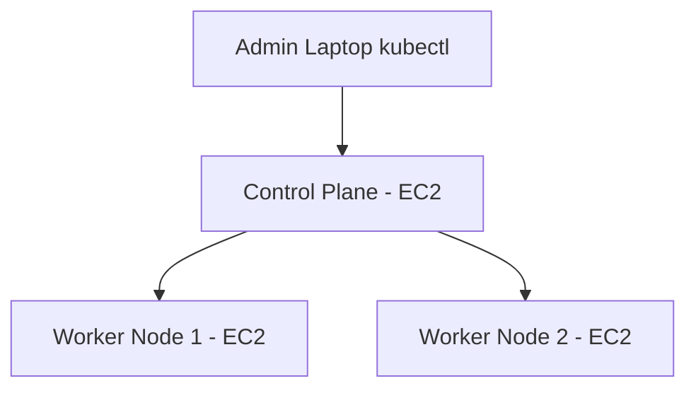
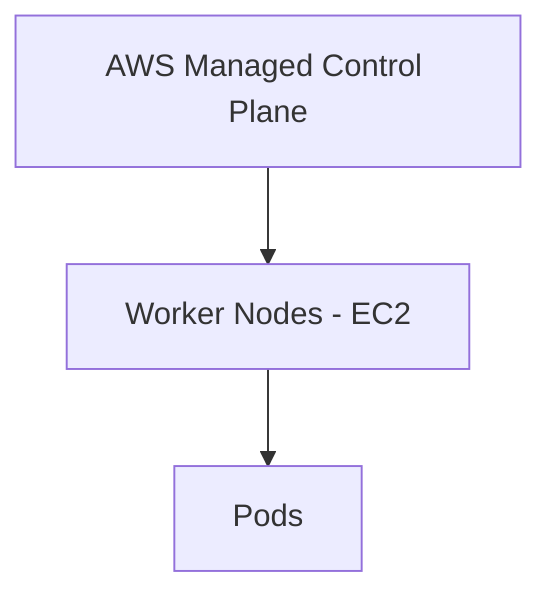

# 📘 Unit II – Deployment and Configuration of Kubernetes

> **Audience:** Absolute Beginners 👶
> **Environment Assumed:** Windows 11 + Docker Desktop (basic idea) + AWS EC2 (Ubuntu)
> **Goal:** Understand *what*, *why*, and *how* of Kubernetes deployment & configuration with **minimal but complete practicals**.

---

## 🧭 What You Will Learn in This Unit

* Installing Kubernetes using **kubeadm**
* Master (Control Plane) & Worker Node setup
* kubectl configuration & context management
* Deploying apps using **YAML manifests**
* Labels, Selectors & Annotations
* **EKS** cluster setup (Console + CLI overview)
* Managing Kubernetes clusters
* RBAC (Roles & RoleBindings)
* Secrets & ConfigMaps

---

## 1️⃣ Installing Kubernetes using kubeadm 🧩

> ⚠️ **Very Important for Beginners**
> From here onwards, every command is clearly marked as:
>
> * 🖥️ **Run on Control Plane (Master) Node**
> * ⚙️ **Run on Worker Node**
> * 💻 **Run on Your Laptop / Admin Machine**
>
> This avoids confusion about *where* commands should be executed.

---

### 🔹 What is kubeadm?

* `kubeadm` is an **official Kubernetes tool** to bootstrap a cluster
* Used mostly in **self-managed clusters** (VMs / EC2)
* Not used in managed services like EKS (AWS manages it)

👉 kubeadm helps you:

* Initialize Control Plane
* Join Worker Nodes

---

### 🔹 Typical kubeadm-based Cluster



---

### 🔹 Prerequisites (EC2 Ubuntu 22.04)

* 2 or more EC2 instances
* Instance type: `t2.medium` or higher
* Open ports: `6443`, `10250`, `30000-32767`

---

### 🔹 Install Kubernetes Components (ALL NODES)

> 📍 **Where to run:**
> 🖥️ Control Plane (Master) Node **AND** ⚙️ Worker Nodes
> (Every EC2 machine must have these installed)

> 🧠 **What this does:**
>
> * Installs:
>
>   * `kubeadm` → cluster bootstrap tool
>   * `kubelet` → node agent (runs pods)
>   * `kubectl` → CLI to control cluster

```bash
sudo apt update
sudo apt install -y apt-transport-https ca-certificates curl

# Add Kubernetes signing key
curl -fsSL https://pkgs.k8s.io/core:/stable:/v1.29/deb/Release.key | sudo gpg --dearmor -o /etc/apt/keyrings/kubernetes-apt-keyring.gpg

# Add Kubernetes repository
echo "deb [signed-by=/etc/apt/keyrings/kubernetes-apt-keyring.gpg] https://pkgs.k8s.io/core:/stable:/v1.29/deb/ /" | sudo tee /etc/apt/sources.list.d/kubernetes.list

# Install Kubernetes components
sudo apt update
sudo apt install -y kubelet kubeadm kubectl

# Prevent auto-upgrade (recommended)
sudo apt-mark hold kubelet kubeadm kubectl
```

> 🔎 **Verification:**

```bash
kubeadm version
kubelet --version
kubectl version --client
```

---

## 2️⃣ Master & Worker Node Setup 🏗️

### 🔹 Initialize Control Plane (MASTER NODE)

> 📍 **Where to run:**
> 🖥️ **ONLY on Control Plane (Master) EC2 instance**

> 🧠 **What this command does:**
>
> * Creates Kubernetes Control Plane components
> * Starts API Server, Scheduler, Controller Manager
> * Generates join token for worker nodes

```bash
sudo kubeadm init --pod-network-cidr=10.244.0.0/16
```

> 📌 **Why pod-network-cidr?**
> This IP range is used by the **Pod Network (Flannel)**. Without this, pods cannot communicate.

> 📌 **IMPORTANT OUTPUT:**
> At the end, kubeadm prints a **kubeadm join command** 👉 copy and save it.

---

### 🔹 Configure kubectl (MASTER)

> 📍 **Where to run:**
> 🖥️ Control Plane (Master) Node

> 🧠 **Why this is required:**
>
> * `kubectl` needs credentials to talk to API Server
> * kubeadm stores admin config at `/etc/kubernetes/admin.conf`

```bash
mkdir -p $HOME/.kube
sudo cp /etc/kubernetes/admin.conf $HOME/.kube/config
sudo chown $(id -u):$(id -g) $HOME/.kube/config
```

> 🔎 **Verification:**

```bash
kubectl get nodes
```

> ❗ At this stage node will show `NotReady` (network not installed yet)

---

### 🔹 Install Pod Network (Flannel)

> 📍 **Where to run:**
> 🖥️ Control Plane (Master) Node

> 🧠 **What is a Pod Network?**
> Kubernetes does NOT provide networking by default.
> A CNI plugin allows **pods to talk to each other across nodes**.

> 🧠 **Why Flannel?**
>
> * Beginner-friendly
> * Simple overlay network

```bash
kubectl apply -f https://raw.githubusercontent.com/flannel-io/flannel/master/Documentation/kube-flannel.yml
```

> 🔎 **Verification:**

```bash
kubectl get pods -n kube-system
kubectl get nodes
```

> ✅ Node status should become `Ready`

---

### 🔹 Join Worker Nodes

> 📍 **Where to run:**
> ⚙️ **ONLY on Worker Node EC2 instances**

> 🧠 **What this does:**
>
> * Connects worker to control plane
> * Registers node with API Server

```bash
sudo kubeadm join <MASTER-IP>:6443 --token <token> \
  --discovery-token-ca-cert-hash sha256:<hash>
```

> 📌 **Where does this command come from?**
> It is printed at the end of `kubeadm init` output.

> 🔎 **Verification (run on MASTER):**

```bash
kubectl get nodes
```

---

## 3️⃣ kubectl & Context Management 🎮

### 🔹 What is kubectl?

* CLI to talk to Kubernetes API Server
* Uses **kubeconfig file**

---

### 🔹 Common kubectl Commands

```bash
kubectl get nodes
kubectl get pods
kubectl get namespaces
kubectl describe pod <pod-name>
```

---

### 🔹 Contexts (Multiple Clusters)

```bash
kubectl config get-contexts
kubectl config use-context <context-name>
```

---

## 4️⃣ Deploying Applications using YAML 📄

### 🔹 Why YAML?

* Declarative (describe desired state)
* Version controllable
* Industry standard

---

### 🔹 Minimal Deployment YAML

```yaml
apiVersion: apps/v1
kind: Deployment
metadata:
  name: nginx-deploy
spec:
  replicas: 2
  selector:
    matchLabels:
      app: nginx
  template:
    metadata:
      labels:
        app: nginx
    spec:
      containers:
      - name: nginx
        image: nginx
        ports:
        - containerPort: 80
```

Apply it:

```bash
kubectl apply -f nginx-deploy.yaml
kubectl get pods
```

---

## 5️⃣ Labels, Selectors & Annotations 🏷️

### 🔹 Labels

* Key-value pairs
* Used for selection

```yaml
labels:
  app: frontend
  env: prod
```

---

### 🔹 Selectors

```yaml
selector:
  matchLabels:
    app: frontend
```

---

### 🔹 Annotations

* Metadata for tools & documentation
* Not used for selection

```yaml
annotations:
  owner: devops-team
  purpose: demo
```

---

## 6️⃣ EKS Cluster Setup (AWS) ☁️

### 🔹 What is EKS?

* Managed Kubernetes by AWS
* No control plane management



---

### 🔹 EKS using AWS Console (High Level)

1. Go to **EKS → Create cluster**
2. Choose VPC & IAM role
3. Add Node Group
4. Connect using kubectl

---

### 🔹 EKS using AWS CLI (Minimal)

```bash
aws eks update-kubeconfig --region ap-south-1 --name my-cluster
kubectl get nodes
```

---

## 7️⃣ Managing Kubernetes Clusters 🔧

### 🔹 Scaling

```bash
kubectl scale deployment nginx-deploy --replicas=5
```

---

### 🔹 Delete Resources

```bash
kubectl delete deployment nginx-deploy
```

---

### 🔹 Cluster Info

```bash
kubectl cluster-info
```

---

## 8️⃣ Role-Based Access Control (RBAC) 🔐

### 🔹 Why RBAC?

* Control **who can do what**
* Security

---

### 🔹 Simple Role

```yaml
apiVersion: rbac.authorization.k8s.io/v1
kind: Role
metadata:
  name: pod-reader
  namespace: default
rules:
- apiGroups: [""]
  resources: ["pods"]
  verbs: ["get", "list"]
```

---

### 🔹 RoleBinding

```yaml
apiVersion: rbac.authorization.k8s.io/v1
kind: RoleBinding
metadata:
  name: read-pods
  namespace: default
subjects:
- kind: User
  name: dev-user
roleRef:
  kind: Role
  name: pod-reader
  apiGroup: rbac.authorization.k8s.io
```

---

## 9️⃣ ConfigMaps & Secrets 🗂️

### 🔹 ConfigMap

Used for **non-sensitive config**

```bash
kubectl create configmap app-config --from-literal=APP_ENV=prod
```

Use in Pod:

```yaml
env:
- name: APP_ENV
  valueFrom:
    configMapKeyRef:
      name: app-config
      key: APP_ENV
```

---

### 🔹 Secrets

Used for **passwords & tokens**

```bash
kubectl create secret generic db-secret --from-literal=password=admin123
```

Use in Pod:

```yaml
env:
- name: DB_PASSWORD
  valueFrom:
    secretKeyRef:
      name: db-secret
      key: password
```

---

## 🔚 Summary

✅ kubeadm → Self-managed clusters (EC2)
✅ kubectl → Command-line control
✅ YAML → Deployment & configuration
✅ EKS → Managed Kubernetes
✅ RBAC → Security
✅ ConfigMaps & Secrets → Configuration

---

🎯 **Tip for Students:**

> First understand kubeadm once, then EKS becomes very easy.

---

📌 *End of Unit II Study Material*
