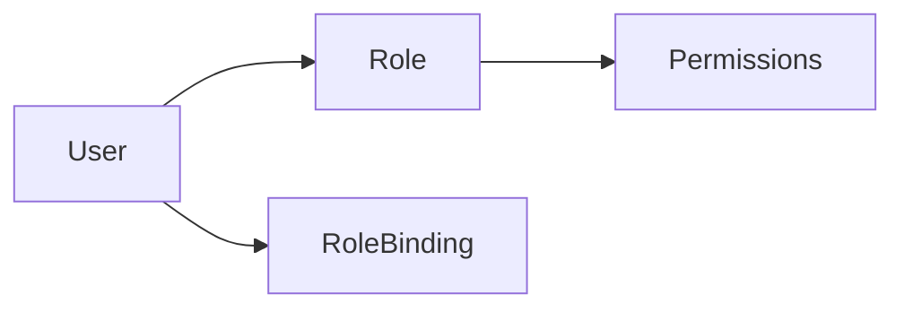

# 📘 Unit II – Deployment & Configuration of Kubernetes

> **Audience:** Absolute Beginners 👶 (No prior Kubernetes knowledge)
> **Target:** Students / Teaching / Exams + Practicals
> **Environment Used for Illustration:** AWS EC2 (Ubuntu 22.04) + kubeadm
> **Focus:** Clear **WHAT**, **WHY**, **WHERE**, **HOW** for **every command**

---

## 🧭 What This Unit Covers

* Installing Kubernetes using **kubeadm**
* Master (Control Plane) & Worker Node setup
* kubectl configuration & context management
* Deploying applications using YAML
* Labels, Selectors & Annotations
* EKS Cluster setup (AWS Console + CLI – conceptual)
* Managing Kubernetes clusters
* **Role-Based Access Control (RBAC)** – minimal & clear
* Secrets & ConfigMaps

---

## 1️⃣ Installing Kubernetes using kubeadm

### 🔹 What is kubeadm?

`kubeadm` is an **official Kubernetes tool** used to:

* Initialize a Kubernetes cluster
* Set up the Control Plane
* Join Worker Nodes

👉 Used in **self-managed clusters** (VMs, EC2)

---

### 🔹 Machines Required

| Machine | Purpose                |
| ------- | ---------------------- |
| EC2-1   | Control Plane (Master) |
| EC2-2   | Worker Node            |

> 💡 Both machines must be Ubuntu and on same network/VPC

---

## 2️⃣ Installing Kubernetes Components (ALL NODES)

> 📍 **Run on:** 🖥️ Master **AND** ⚙️ Worker Nodes

### 🧠 What are these components?

| Component | Purpose                |
| --------- | ---------------------- |
| kubelet   | Runs pods on node      |
| kubeadm   | Bootstraps cluster     |
| kubectl   | CLI to control cluster |

### ▶️ Commands

```bash
sudo apt update
sudo apt install -y apt-transport-https ca-certificates curl

curl -fsSL https://pkgs.k8s.io/core:/stable:/v1.29/deb/Release.key | sudo gpg --dearmor -o /etc/apt/keyrings/kubernetes-apt-keyring.gpg

echo "deb [signed-by=/etc/apt/keyrings/kubernetes-apt-keyring.gpg] https://pkgs.k8s.io/core:/stable:/v1.29/deb/ /" | sudo tee /etc/apt/sources.list.d/kubernetes.list

sudo apt update
sudo apt install -y kubelet kubeadm kubectl
sudo apt-mark hold kubelet kubeadm kubectl
```

### 🔎 Verify

```bash
kubeadm version
kubelet --version
kubectl version --client
```

---

## 3️⃣ Initialize Control Plane (Master Node)

> 📍 **Run on:** 🖥️ Control Plane ONLY

### 🧠 What happens here?

* API Server starts
* Scheduler & Controller start
* Cluster certificates generated

### ▶️ Command

```bash
sudo kubeadm init --pod-network-cidr=10.244.0.0/16
```

> 📌 **IMPORTANT:** Copy the `kubeadm join` command shown in output

---

## 4️⃣ Configure kubectl (Master Node)

> 📍 **Run on:** 🖥️ Master Node

### 🧠 Why needed?

`kubectl` needs credentials to talk to API Server

### ▶️ Commands

```bash
mkdir -p $HOME/.kube
sudo cp /etc/kubernetes/admin.conf $HOME/.kube/config
sudo chown $(id -u):$(id -g) $HOME/.kube/config
```

### 🔎 Verify

```bash
kubectl get nodes
```

> ❗ Node will be `NotReady` (network not installed yet)

---

## 5️⃣ Install Pod Network (Flannel)

> 📍 **Run on:** 🖥️ Master Node

### 🧠 Why needed?

Kubernetes does NOT provide networking by default

### ▶️ Command

```bash
kubectl apply -f https://raw.githubusercontent.com/flannel-io/flannel/master/Documentation/kube-flannel.yml
```

### 🔎 Verify

```bash
kubectl get nodes
```

> ✅ Status should be `Ready`

---

## 6️⃣ Join Worker Node

> 📍 **Run on:** ⚙️ Worker Node

### ▶️ Command (from kubeadm init output)

```bash
sudo kubeadm join <MASTER-IP>:6443 --token <token> \
 --discovery-token-ca-cert-hash sha256:<hash>
```

### 🔎 Verify (on Master)

```bash
kubectl get nodes
```

---

## 7️⃣ kubectl Basics & Context

> 📍 **Run on:** 🖥️ Master / Admin machine

```bash
kubectl get pods
kubectl get nodes
kubectl get namespaces
kubectl cluster-info
```

---

## 8️⃣ Deploying Applications using YAML

### 🧠 Why YAML?

* Declarative
* Repeatable
* Version controlled

---

### 📄 Minimal Deployment YAML

```yaml
apiVersion: apps/v1
kind: Deployment
metadata:
  name: nginx-deploy
spec:
  replicas: 2
  selector:
    matchLabels:
      app: nginx
  template:
    metadata:
      labels:
        app: nginx
    spec:
      containers:
      - name: nginx
        image: nginx
        ports:
        - containerPort: 80
```

### ▶️ Apply

```bash
kubectl apply -f nginx.yaml
kubectl get pods
```

---

## 9️⃣ Labels, Selectors & Annotations

### 🔹 Labels (Identification)

```yaml
labels:
  app: frontend
  env: prod
```

### 🔹 Selectors (Matching)

```yaml
selector:
  matchLabels:
    app: frontend
```

### 🔹 Annotations (Metadata)

```yaml
annotations:
  owner: devops-team
```

---

## 🔟 Managing Kubernetes Cluster

### 🔹 Scaling

```bash
kubectl scale deployment nginx-deploy --replicas=5
```

### 🔹 Delete

```bash
kubectl delete deployment nginx-deploy
```

---

## 1️⃣1️⃣ Role-Based Access Control (RBAC)

### 🧠 What is RBAC?

RBAC controls:

> **Who** can do **what** on **which resource**

---

### 🧩 RBAC Components



---

### 🎯 Example: User can READ Pods ONLY

#### Step 1️⃣ Create Role

```yaml
apiVersion: rbac.authorization.k8s.io/v1
kind: Role
metadata:
  name: pod-reader
  namespace: default
rules:
- apiGroups: [""]
  resources: ["pods"]
  verbs: ["get", "list"]
```

```bash
kubectl apply -f role.yaml
```

---

#### Step 2️⃣ Bind Role to User

```yaml
apiVersion: rbac.authorization.k8s.io/v1
kind: RoleBinding
metadata:
  name: pod-reader-binding
  namespace: default
subjects:
- kind: User
  name: dev-user
roleRef:
  kind: Role
  name: pod-reader
  apiGroup: rbac.authorization.k8s.io
```

```bash
kubectl apply -f rolebinding.yaml
```

---

#### Step 3️⃣ Test Permission

```bash
kubectl auth can-i list pods --as dev-user
kubectl auth can-i delete pods --as dev-user
```

---

## 1️⃣2️⃣ ConfigMaps & Secrets

### 🔹 ConfigMap (Non-sensitive)

```bash
kubectl create configmap app-config --from-literal=APP_ENV=prod
```

---

### 🔹 Secret (Sensitive)

```bash
kubectl create secret generic db-secret --from-literal=password=admin123
```

---

## ☁️ EKS Overview (Conceptual)

* AWS manages Control Plane
* You manage Worker Nodes

```bash
aws eks update-kubeconfig --name my-cluster
kubectl get nodes
```

---

## ✅ Unit II Summary

* kubeadm → self-managed clusters
* YAML → deployments
* RBAC → security
* ConfigMaps/Secrets → configuration
* EKS → managed Kubernetes

---

🎯 **Teaching Tip:**

> If students understand RBAC + YAML, Kubernetes becomes easy.

---

📌 *End of Unit II*
