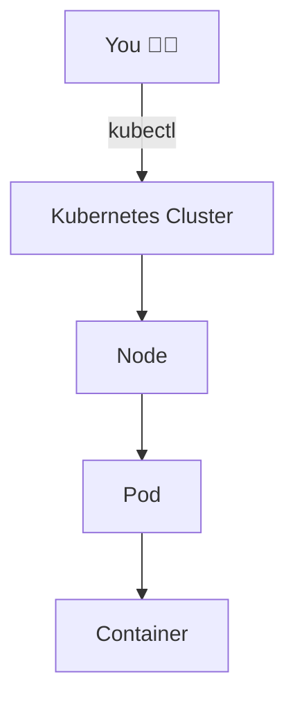
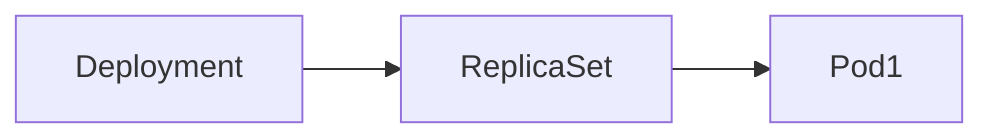
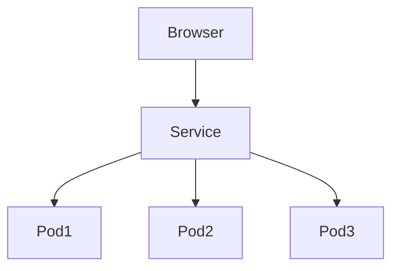

---

# 🚀 Kubernetes for Absolute Beginners (Using Minikube on Windows 11)

> 🧠 **Goal:**
> Learn Kubernetes **from scratch** by running everything locally using **Minikube + Docker Desktop**

---

## 📌 Prerequisites (Already Done)

✅ Windows 11
✅ Docker Desktop installed & running
✅ Internet connection

> 🟢 Minikube will use **Docker** as its backend (no VirtualBox needed)

---

## 🧩 What is Kubernetes? (1-line)

👉 Kubernetes is a system that **runs, manages, scales, and heals containers automatically**

---

## 🧱 Big Picture (Very Important)



---

## 🧠 Key Terms (Must Read Once)

| Term       | Meaning                        |
| ---------- | ------------------------------ |
| Cluster    | Whole Kubernetes system        |
| Node       | A machine (VM) inside cluster  |
| Pod        | Smallest unit (runs container) |
| Container  | Docker container               |
| Deployment | Manages Pods                   |
| Service    | Exposes Pods                   |
| kubectl    | Kubernetes command tool        |
| Minikube   | Local Kubernetes               |

---

## ⚙️ Step 1: Install Minikube (Windows)

### 🔹 Download

👉 [https://minikube.sigs.k8s.io/docs/start/](https://minikube.sigs.k8s.io/docs/start/)

Install **Windows Installer (.exe)**

---

## 🔍 Step 2: Verify Installation

```bash
minikube version
kubectl version --client
```

✅ If commands work → good

---

## ▶️ Step 3: Start Kubernetes Cluster

```bash
minikube start
```

🧠 What happens:

* Creates a **local Kubernetes cluster**
* Creates **1 node**
* Uses **Docker Desktop**

---

## 🔎 Step 4: Check Cluster Status

```bash
minikube status
```

```bash
kubectl cluster-info
```

---

## 🖥️ Step 5: Check Nodes

```bash
kubectl get nodes
```

📌 Output idea:

```
NAME       STATUS   ROLES    AGE   VERSION
minikube   Ready    control-plane   2m
```

🧠 **Node = virtual machine**

---

## 📦 Step 6: Create Your First Pod

### 🔹 Run an Nginx Pod

```bash
kubectl run mypod --image=nginx
```

---

### 🔹 Check Pod Status

```bash
kubectl get pods
```

📌 Possible states:

* `Pending`
* `Running`
* `CrashLoopBackOff`

---

## 🔍 Step 7: Describe Pod (Very Useful)

```bash
kubectl describe pod mypod
```

🧠 Shows:

* Events
* Errors
* Image pulled or not

---

## 🗑️ Step 8: Delete Pod

```bash
kubectl delete pod mypod
```

📌 **Pods are temporary — not used directly in real apps**

---

## 🏗️ Step 9: Create Deployment (Real Way)

> 🧠 Deployment = Manages Pods automatically

```bash
kubectl create deployment web --image=nginx
```

---

### 🔍 Check Deployment

```bash
kubectl get deployments
```

```bash
kubectl get pods
```

---

## 🔁 Deployment → Pod Relationship



---

## 📈 Step 10: Scale Application

### 🔹 Scale to 3 Pods

```bash
kubectl scale deployment web --replicas=3
```

```bash
kubectl get pods
```

📌 Kubernetes automatically creates more Pods 🎯

---

## 📉 Step 11: Scale Down

```bash
kubectl scale deployment web --replicas=1
```

---

## 🔄 Step 12: Self Healing Demo

```bash
kubectl delete pod <pod-name>
```

👉 Kubernetes **creates a new pod automatically**

🧠 This is **AUTO HEALING**

---

## 🌐 Step 13: Expose Application (Service)

> Pods have **internal IPs** → not accessible from browser

### 🔹 Create Service

```bash
kubectl expose deployment web --type=NodePort --port=80
```

---

### 🔍 Check Services

```bash
kubectl get services
```

---

## 🌍 Step 14: Access Application in Browser

```bash
minikube service web
```

🎉 NGINX page opens in browser

---

## 🧱 Service Flow



---

## 🧹 Step 15: Delete Resources (Cleanup)

### 🔹 Delete Service

```bash
kubectl delete service web
```

### 🔹 Delete Deployment

```bash
kubectl delete deployment web
```

---

## 🛑 Step 16: Stop Cluster

```bash
minikube stop
```

---

## ❌ Step 17: Delete Cluster Completely

```bash
minikube delete
```

---

## 🧠 Complete Command Timeline (Quick Revision)

```bash
minikube start
kubectl get nodes
kubectl run mypod --image=nginx
kubectl delete pod mypod
kubectl create deployment web --image=nginx
kubectl scale deployment web --replicas=3
kubectl expose deployment web --type=NodePort --port=80
minikube service web
kubectl delete service web
kubectl delete deployment web
minikube stop
minikube delete
```

---

## 🎯 What You Learned

✅ Kubernetes basics
✅ Pods vs Deployments
✅ Scaling
✅ Auto-healing
✅ Services
✅ Minikube workflow

---

## 🚀 What Next? (Advanced Topics)

➡️ YAML files
➡️ ConfigMaps & Secrets
➡️ Volumes
➡️ Namespaces
➡️ Helm
➡️ Kubernetes on Cloud (EKS, AKS)

---

