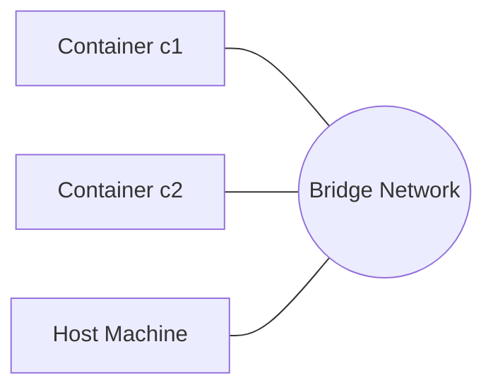
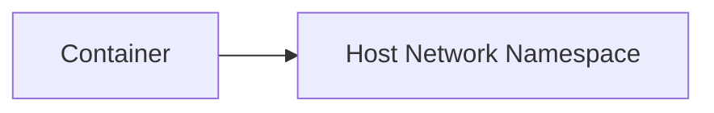
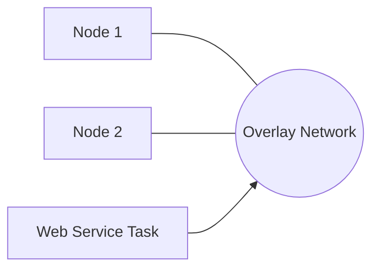
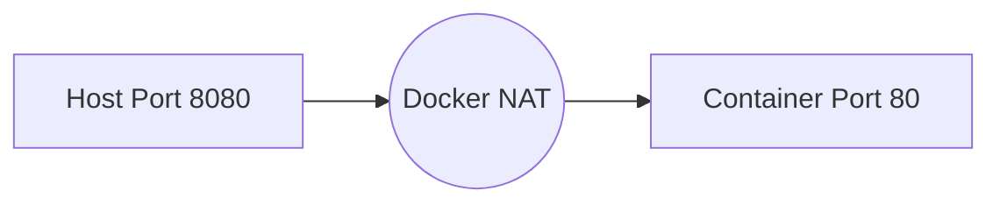

---

# 🐳 Docker Networking – Quick Beginner Guide

## 📌 What You Will Learn

* Bridge network
* Host network
* Overlay network
* DNS inside Docker
* Linking containers
* Port mapping

---

# 1️⃣ Bridge Network (Default Network) 🌉

The **bridge network** is used when you run containers normally (`docker run`).
Containers can talk to each other **inside the same bridge network**.

### Create a bridge network

```sh
docker network create my-bridge
```

### Run containers inside it

```sh
docker run -it --name c1 --network my-bridge ubuntu
docker run -it --name c2 --network my-bridge ubuntu
```

### Test connectivity

Inside `c1`:

```sh
ping c2
```

🎉 DNS inside Docker automatically resolves container names.

---

### 🔍 Bridge Network Diagram



---

# 2️⃣ Host Network 🖥️

The container uses the **host's network stack** directly.
➡️ No port mapping needed because container **shares** host’s ports.

### Run with host network

```sh
docker run -it --network host ubuntu
```

⚠️ Works fully on Linux.
On Docker Desktop (Windows/Mac), internal VM limitations apply.

---

### 🖥️ Host Network Diagram



---

# 3️⃣ Overlay Network 🌐 (Used in Swarm)

Used to connect containers across **multiple servers** in Docker Swarm.

### Initialize Swarm

```sh
docker swarm init
```

### Create overlay network

```sh
docker network create -d overlay my-overlay
```

### Deploy service using overlay

```sh
docker service create --name web --network my-overlay nginx
```

---

### 🌐 Overlay Diagram



---

# 4️⃣ DNS Inside Docker 📡

Docker automatically provides:

* DNS resolution by **container names**
* Built-in DNS server inside each network

### Example

Start two containers:

```sh
docker run -it --name app1 --network my-bridge ubuntu
docker run -it --name app2 --network my-bridge ubuntu
```

Inside `app1`:

```sh
ping app2
```

✔️ No IP needed — Docker resolves the name automatically.

---

# 5️⃣ Linking Containers 🔗 (Old Method)

⚠️ **Deprecated**, but still asked in interviews.

### Example

```sh
docker run -d --name db redis
docker run -it --link db:redis ubuntu
```

Inside Ubuntu container:

```sh
ping redis
```

Docker injects host entries for inter-container communication.

---

# 6️⃣ Port Mapping 🔌 (Host ↔ Container)

To access a container service from **Windows**, you must expose ports.

### Syntax

```
docker run -p <host-port>:<container-port>
```

### Example: Run Nginx

```sh
docker run -d -p 8080:80 nginx
```

Now open in Windows browser:

👉 [http://localhost:8080](http://localhost:8080)

---

### 🔌 Port Mapping Diagram



---

# 🧪 Quick Test Commands (For Students)

### See networks

```sh
docker network ls
```

### Inspect a network

```sh
docker network inspect bridge
```

### Connect a running container to a network

```sh
docker network connect my-bridge c1
```

### Disconnect container from a network

```sh
docker network disconnect my-bridge c1
```

---

# 🎉 Summary Table

| Concept          | Use Case                          | Example                                 |
| ---------------- | --------------------------------- | --------------------------------------- |
| **Bridge**       | Default network for containers    | `docker run -it ubuntu`                 |
| **Host**         | High-performance, no port mapping | `docker run --network host`             |
| **Overlay**      | Multi-node networking in swarm    | `docker network create -d overlay net1` |
| **DNS**          | Uses container names              | `ping app2`                             |
| **Linking**      | Old container linking             | `--link db`                             |
| **Port Mapping** | Expose service to host            | `-p 8080:80`                            |

---

# ⭐ End of Guide

Just tell me!
