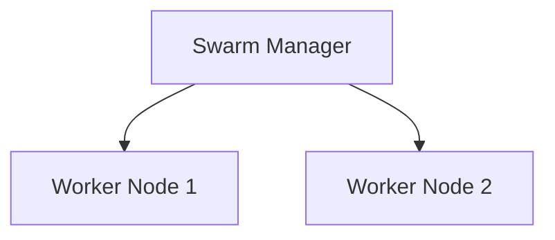

# 🐳 Docker Swarm – Hands-On Guide (1 Manager + 2 Workers using Containers)

> **Goal:** Learn Docker Swarm by **actually creating a cluster** with **1 manager and 2 worker nodes**, all running as **Docker containers**.
>
> **Audience:** Beginners, DevOps students, trainers
> **Platform:** Windows 11 + Docker Desktop

---

## 🔰 Why This Approach?

Normally:

* Docker Swarm nodes are **separate machines / VMs**

For learning:

* We simulate nodes using **Docker containers**
* Faster, safer, perfect for training

👉 This is a **learning lab**, not production.

---

## 🧠 What We Will Build



* 3 containers
* 1 Swarm manager
* 2 Swarm workers
* Real service deployment & scaling

---

## ⚙️ Prerequisites

* Windows 11
* Docker Desktop installed and running
* Basic Docker knowledge

Verify:

```bash
docker version
```

---

## 📦 Step 1: Create a Docker Network (For Swarm Nodes)

We need a **private network** so containers can talk to each other.

```bash
docker network create swarm-net
```

Verify:

```bash
docker network ls
```

---

## 🧱 Step 2: Create Manager and Worker Containers

We use **Docker-in-Docker (dind)** image.

### Create Manager Container

```bash
docker run -dit \
  --name manager \
  --privileged \
  --network swarm-net \
  docker:dind
```

### Create Worker 1

```bash
docker run -dit \
  --name worker1 \
  --privileged \
  --network swarm-net \
  docker:dind
```

### Create Worker 2

```bash
docker run -dit \
  --name worker2 \
  --privileged \
  --network swarm-net \
  docker:dind
```

Verify containers:

```bash
docker ps
```

---

## 🚀 Step 3: Initialize Docker Swarm on Manager

Enter manager container:

```bash
docker exec -it manager sh
```

Initialize Swarm:

```bash
docker swarm init --advertise-addr manager
```

✔ This container is now the **Swarm Manager**

Copy the **worker join command** shown in output.

Exit manager shell:

```bash
exit
```

---

## 👥 Step 4: Join Worker Nodes to the Swarm

### Worker 1

```bash
docker exec -it worker1 sh
<PASTE worker join command here>
exit
```

### Worker 2

```bash
docker exec -it worker2 sh
<PASTE worker join command here>
exit
```

---

## 🔍 Step 5: Verify Swarm Cluster

Enter manager:

```bash
docker exec -it manager sh
```

Check nodes:

```bash
docker node ls
```

Expected output:

```
NAME       STATUS   AVAILABILITY   MANAGER STATUS
manager    Ready    Active         Leader
worker1    Ready    Active
worker2    Ready    Active
```

🎉 **Your 3-node Docker Swarm cluster is ready!**

---

## 📦 Step 6: Deploy a Service on the Swarm

Still inside manager container:

```bash
docker service create \
  --name web \
  --replicas 3 \
  -p 8080:80 \
  nginx
```

---

## 🔍 Step 7: Inspect Service Distribution

```bash
docker service ps web
```

You will see tasks running across:

* manager
* worker1
* worker2

---

## 🌍 Step 8: Access the Application

Open browser:

```
http://localhost:8080
```

✔ Docker Swarm ingress routes traffic automatically.

---

## 📈 Step 9: Scale the Service

```bash
docker service scale web=6
```

Verify:

```bash
docker service ps web
```

---

## 🔄 Step 10: Rolling Update

```bash
docker service update \
  --image nginx:alpine \
  web
```

Docker Swarm updates containers **one by one**.

---

## 🔁 Step 11: Self-Healing Demo

Stop a task container:

```bash
docker ps
docker stop <task-container-id>
```

Result:

* Swarm automatically creates a new task ✅

---

## 🧹 Step 12: Cleanup

Remove service:

```bash
docker service rm web
```

Leave swarm (all nodes):

```bash
docker swarm leave --force
```

Remove containers:

```bash
docker rm -f manager worker1 worker2
```

Remove network:

```bash
docker network rm swarm-net
```

---

## 🧠 Mental Model (Remember This)

```
Swarm
 ├── Manager (leader)
 ├── Worker 1
 └── Worker 2

Service
 └── Tasks (containers)
```

---

## 🎯 Key Learning Outcomes

* Built a real Swarm cluster (simulated)
* Understood manager & worker roles
* Deployed, scaled, updated services
* Saw self-healing in action

---

✅ **End of Docker Swarm Multi-Node Hands-On Guide**
