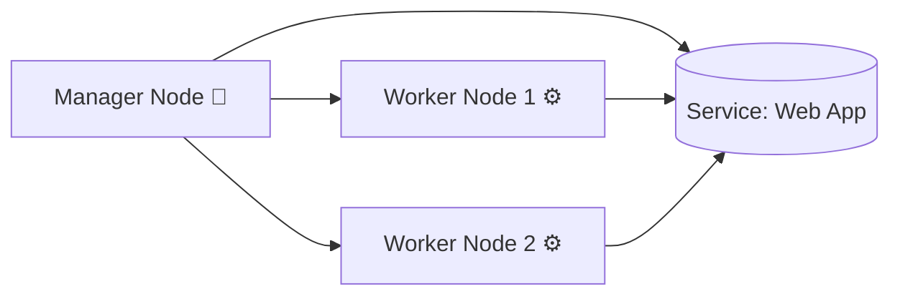
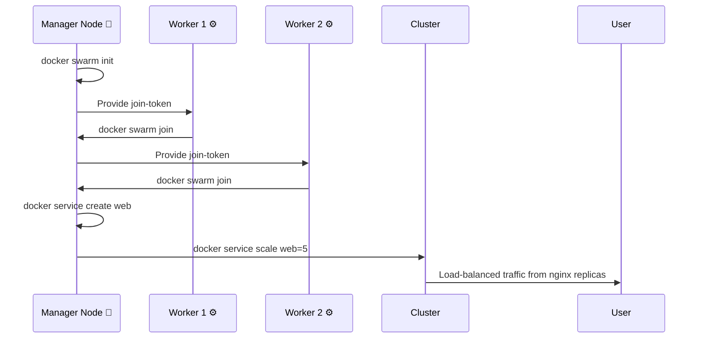

---

# 📘 **Docker Swarm – Complete Beginner’s Guide + Full Working Example**

This guide explains:

✅ What Docker Swarm is
✅ Why we need Swarm
✅ How to simulate 3 servers on one laptop
✅ How to create a cluster
✅ How to deploy & scale services
✅ What every command and option means
✅ Mermaid diagrams for understanding

---

# 🧠 **What is Docker Swarm? (Beginner Explanation)**

Docker Swarm is a built-in **container orchestration system** inside Docker.
It allows you to:

* 🖥️ Combine many machines into a **cluster**
* ⚙️ Deploy apps as **services**
* 📦 Run multiple **replicas** for scaling
* 🔄 Update apps with **zero downtime**
* 🔗 Automatically **load balance** traffic

Think of Swarm like:

> “Multiple computers acting as one big computer for running containers.”

---

# 🖥️ **Architecture Diagram (Mermaid)**



---

# 🛠 **Before We Start – What Are We Doing?**

We will create **3 fake servers** using Docker containers (Docker-in-Docker).

This is safe and works on Windows, Mac, Linux.

| Node    | Purpose                |
| ------- | ---------------------- |
| manager | Controls Swarm (brain) |
| worker1 | Runs containers        |
| worker2 | Runs containers        |

---

# 🚀 **STEP 1 — Create 3 Nodes Using Docker-in-Docker (DIND)**

### Why `--privileged`?

Because Docker-in-Docker needs full Linux privileges to run Docker inside Docker.

### Commands:

```bash
docker run -d --name manager --privileged docker:dind
docker run -d --name worker1 --privileged docker:dind
docker run -d --name worker2 --privileged docker:dind
```

### Explanation:

| Option         | Meaning                                |
| -------------- | -------------------------------------- |
| `-d`           | Run container in **detached** mode     |
| `--name`       | Give container a friendly name         |
| `--privileged` | Allow Docker to run inside Docker      |
| `docker:dind`  | DIND image that includes Docker Engine |

---

# 🔍 **STEP 2 — Get Inside the Manager Node**

```bash
docker exec -it manager sh
```

| Option | Meaning                      |
| ------ | ---------------------------- |
| `exec` | Run command inside container |
| `-it`  | Interactive terminal         |
| `sh`   | Open shell                   |

---

# 👑 **STEP 3 — Initialize Docker Swarm**

Inside **manager**:

```bash
docker swarm init --advertise-addr eth0
```

### Explanation:

| Part                    | Meaning                                                                 |
| ----------------------- | ----------------------------------------------------------------------- |
| `docker swarm init`     | Create a new swarm cluster                                              |
| `--advertise-addr eth0` | Tells manager which network interface IP to use so workers can reach it |

The output gives a **join token**:

```
docker swarm join --token <token> <manager-ip>:2377
```

---

# 🤝 **STEP 4 — Join Worker Nodes to the Swarm**

Open terminals inside workers:

### Worker1:

```bash
docker exec -it worker1 sh
docker swarm join --token <token> <manager-ip>:2377
```

### Worker2:

```bash
docker exec -it worker2 sh
docker swarm join --token <token> <manager-ip>:2377
```

---

# 📋 **STEP 5 — Verify the Swarm Cluster**

On **manager**:

```bash
docker node ls
```

Expected output:

```
ID         HOSTNAME   STATUS   MANAGER STATUS
xxxxxxx    manager    Ready    Leader
yyyyyyy    worker1    Ready
zzzzzzz    worker2    Ready
```

---

# 🌐 **STEP 6 — Deploy a Web Service**

We deploy an Nginx service.

```bash
docker service create --name web -p 8080:80 nginx
```

### Explanation:

| Part                    | Meaning                                         |
| ----------------------- | ----------------------------------------------- |
| `docker service create` | Create a new service in Swarm                   |
| `--name web`            | Service name                                    |
| `-p 8080:80`            | Map your laptop’s port 8080 → container port 80 |
| `nginx`                 | The image to deploy                             |

---

# 📊 **STEP 7 — Check the Service Status**

```bash
docker service ls
docker service ps web
```

### `docker service ps web` shows where the containers are running.

---

# 📈 **STEP 8 — Scale the Service Across Nodes**

```bash
docker service scale web=5
```

Swarm auto-distributes containers across manager, worker1, worker2.

---

# 🔁 **STEP 9 — Test Load Balancing**

On your host machine:

```bash
curl http://localhost:8080
```

Refresh/multiple curls — responses come from different replicas.

Swarm load-balances automatically. ⚖️

---

# 🔧 **STEP 10 — Update the Service (Zero Downtime)**

```bash
docker service update --image nginx:latest web
```

Swarm replaces old containers one by one → app stays online.

---

# ❌ **STEP 11 — Remove Service**

```bash
docker service rm web
```

---

# 🛑 **STEP 12 — Shutdown Swarm**

Workers:

```bash
docker swarm leave
```

Manager:

```bash
docker swarm leave --force
```

---

# 🧹 **STEP 13 — Stop and Remove Demo Nodes**

```bash
docker rm -f manager worker1 worker2
```

---

# 🧭 **FULL WORKFLOW DIAGRAM (Mermaid)**



---

# 🎉 **SUMMARY**

| Concept        | Meaning                                 |
| -------------- | --------------------------------------- |
| Swarm          | Docker’s built-in cluster/orchestrator  |
| Manager        | Controls the cluster                    |
| Worker         | Runs containers                         |
| Service        | App running in the cluster              |
| Replicas       | Multiple copies of the service          |
| Scaling        | Adding/removing replicas                |
| Load Balancing | Swarm distributes traffic automatically |

---

Tell me the format and I’ll generate the file for you!
