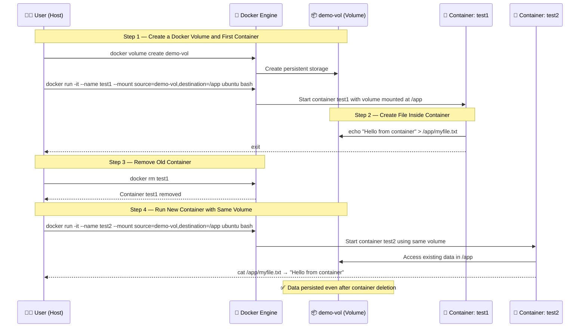

```mermaid
sequenceDiagram
    participant User as 👨‍💻 User (Host)
    participant Docker as 🐳 Docker Engine
    participant Vol as 📦 demo-vol (Volume)
    participant C1 as 🧱 Container: test1
    participant C2 as 🧱 Container: test2

    Note over User,Vol: Step 1 — Create a Docker Volume and First Container
    User->>Docker: docker volume create demo-vol
    Docker->>Vol: Create persistent storage
    User->>Docker: docker run -it --name test1 --mount source=demo-vol,destination=/app ubuntu bash
    Docker->>C1: Start container test1 with volume mounted at /app

    Note over C1,Vol: Step 2 — Create File Inside Container
    C1->>Vol: echo "Hello from container" > /app/myfile.txt
    C1-->>User: exit

    Note over User,Docker: Step 3 — Remove Old Container
    User->>Docker: docker rm test1
    Docker-->>User: Container test1 removed

    Note over User,Vol: Step 4 — Run New Container with Same Volume
    User->>Docker: docker run -it --name test2 --mount source=demo-vol,destination=/app ubuntu bash
    Docker->>C2: Start container test2 using same volume
    C2->>Vol: Access existing data in /app
    C2-->>User: cat /app/myfile.txt → "Hello from container"

    Note over Vol: ✅ Data persisted even after container deletion
```
