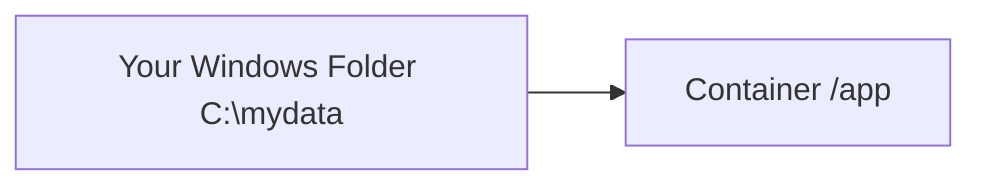

---

# 🐳 Docker Volume Mounting – Beginner Guide (Windows 11)

## 📌 What You Will Learn

* What is a **Docker Volume**?
* Types of volume mounting
* How to create and use volumes with **simple examples**
* Step-by-step commands
* Mermaid diagrams to visualize everything

---

## 1️⃣ What is a Docker Volume? 🗂️

A **Docker Volume** is a special folder on your computer where Docker stores data **outside** the container.

💡 **Why use volumes?**

* Data does **not get deleted** when container stops.
* You can share data between multiple containers.
* Easier for beginners to work with files.

---

## 2️⃣ Types of Volume Mounts

### **A. Named Volume** (Docker manages location)

You create a volume → attach it to container → data persists.

```
docker volume create my-vol
docker run -it -v my-vol:/data ubuntu
```

### **B. Bind Mount** (You provide host folder path)

You select a folder on Windows → Docker mounts it inside container.

```
docker run -it -v C:\Users\scifi\mydata:/data ubuntu
```

---

## 3️⃣ Visual Diagram – How Volume Works 🗃️

### 📦 Named Volume Architecture


### 📁 Bind Mount Architecture



---

# 4️⃣ Step-by-Step Guide 👣 (Absolute Beginners)

---

## ⭐ Example 1: Named Volume (Best for Beginners)

### **Step 1: Create a Volume**

```sh
docker volume create demo-vol
```

✔️ Creates a persistent volume named **demo-vol**

---

### **Step 2: Run a Container Using the Volume**

```sh
docker run -it --name test1 -v demo-vol:/app ubuntu
```

✔️ Inside the container, `/app` is connected to the volume

---

### **Step 3: Add a File Inside the Container**

```sh
echo "Hello from volume!" > /app/hello.txt
exit
```

---

### **Step 4: Start Another Container & Check the Same File**

```sh
docker run -it --name test2 -v demo-vol:/app ubuntu
cat /app/hello.txt
```

🎉 You will see:

```
Hello from volume!
```

This proves that the file **persisted** outside the first container.

---

## ⭐ Example 2: Bind Mount (Windows Folder → Container)

### **Step 1: Create a folder on Windows**

Open PowerShell:

```powershell
mkdir C:\docker-bind-demo
echo "hello world" > C:\docker-bind-demo\test.txt
```

---

### **Step 2: Run Container with Bind Mount**

```sh
docker run -it -v C:\docker-bind-demo:/data ubuntu
```

---

### **Step 3: Check File Inside Container**

```sh
cat /data/test.txt
```

---

### **Step 4: Create New File in Container**

```sh
echo "file created inside container" > /data/new.txt
```

✔️ Now check on Windows — the file appears in
`C:\docker-bind-demo\new.txt`

🎉 Bind mount works both ways!

---

# 🧹 Extra: Useful Volume Commands

### List all volumes

```sh
docker volume ls
```

### Inspect volume details

```sh
docker volume inspect demo-vol
```

### Remove a volume

```sh
docker volume rm demo-vol
```

---

# 🎉 Final Mermaid Summary Diagram


Just tell me!
