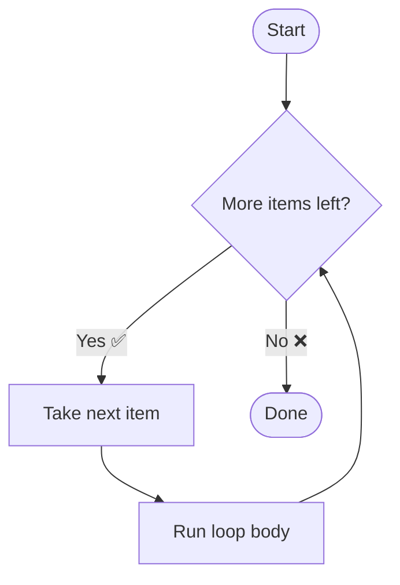
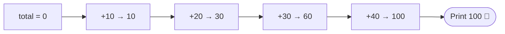

# 🔁 For Loops in Python

> A beginner-friendly guide to repeating tasks the smart way.

---

## 🎯 What Is a For Loop?

A **for loop** lets you run the same block of code once for **each item** in a sequence (like a list, string, or range of numbers). Instead of writing the same line 100 times, you write it once and let Python repeat it. ✨

<svg viewBox="0 0 640 120" xmlns="http://www.w3.org/2000/svg" role="img" aria-label="Loop concept">
  <rect x="0" y="0" width="640" height="120" fill="#0f2b2e" rx="12"/>
  <text x="24" y="45" fill="#5eead4" font-family="monospace" font-size="20">🍎 → 🍊 → 🍌 → 🍇</text>
  <text x="24" y="85" fill="#a7f3d0" font-family="monospace" font-size="16">for each fruit → do something 🔁</text>
</svg>

---

## 🧭 How It Flows



---

## 🧩 The Basic Syntax

```python
for variable in sequence:
    # code to repeat (indented!)
    print(variable)
```

| 🔑 Part | 💬 Meaning |
|--------|-----------|
| `for` | Keyword that starts the loop |
| `variable` | Holds the current item each round |
| `in` | Connects the variable to the sequence |
| `sequence` | The collection to loop over |
| `:` | Ends the loop header |
| **indent** | The body — must be indented (4 spaces) |

> ⚠️ **Indentation is not optional in Python.** It defines what belongs to the loop.

---

## 🚶 Example 1: Loop Over a List

```python
fruits = ["apple", "orange", "banana"]

for fruit in fruits:
    print("I like", fruit)
```

**Output** 👇
```
I like apple
I like orange
I like banana
```

🧠 **Steps:**
1. Python grabs `"apple"` → runs the body → prints it
2. Grabs `"orange"` → runs the body → prints it
3. Grabs `"banana"` → runs the body → prints it
4. No more items → loop ends ✅

---

## 🔢 Example 2: Loop With `range()`

`range()` generates numbers for you — perfect for counting.

```python
for i in range(5):
    print("Count:", i)
```

**Output** 👇
```
Count: 0
Count: 1
Count: 2
Count: 3
Count: 4
```

> 📌 `range(5)` gives `0, 1, 2, 3, 4` — it **starts at 0** and **stops before 5**.

### 🎛️ `range()` Variations

```python
range(1, 6)      # 1, 2, 3, 4, 5   (start, stop)
range(0, 10, 2)  # 0, 2, 4, 6, 8   (start, stop, step)
range(5, 0, -1)  # 5, 4, 3, 2, 1   (countdown!)
```

---

## 🔤 Example 3: Loop Over a String

```python
for letter in "CODE":
    print(letter)
```

**Output** 👇
```
C
O
D
E
```

---

## 🏷️ Example 4: Get Index + Value with `enumerate()`

```python
colors = ["red", "green", "blue"]

for index, color in enumerate(colors):
    print(index, "→", color)
```

**Output** 👇
```
0 → red
1 → green
2 → blue
```

---

## ➕ Example 5: A Practical Task (Summing Numbers)

```python
numbers = [10, 20, 30, 40]
total = 0

for n in numbers:
    total = total + n   # add each number to the running total

print("Total:", total)
```

**Output** 👇
```
Total: 100
```



---

## 🛑 Controlling the Loop

<svg viewBox="0 0 640 80" xmlns="http://www.w3.org/2000/svg" role="img" aria-label="Loop control keywords">
  <rect x="0" y="0" width="200" height="80" fill="#7f1d1d" rx="10"/>
  <text x="40" y="35" fill="#fecaca" font-family="monospace" font-size="18">break 🛑</text>
  <text x="18" y="60" fill="#fca5a5" font-family="monospace" font-size="12">exit the loop</text>
  <rect x="220" y="0" width="200" height="80" fill="#78350f" rx="10"/>
  <text x="255" y="35" fill="#fed7aa" font-family="monospace" font-size="18">continue ⏭️</text>
  <text x="245" y="60" fill="#fdba74" font-family="monospace" font-size="12">skip this round</text>
  <rect x="440" y="0" width="200" height="80" fill="#14532d" rx="10"/>
  <text x="490" y="35" fill="#bbf7d0" font-family="monospace" font-size="18">else ✅</text>
  <text x="465" y="60" fill="#86efac" font-family="monospace" font-size="12">runs if no break</text>
</svg>

### 🛑 `break` — stop early

```python
for n in range(1, 10):
    if n == 5:
        break        # stop when we hit 5
    print(n)
```
**Output:** `1 2 3 4`

### ⏭️ `continue` — skip an item

```python
for n in range(1, 6):
    if n == 3:
        continue     # skip 3
    print(n)
```
**Output:** `1 2 4 5`

### ✅ `for ... else` — runs when loop finishes normally

```python
for n in range(3):
    print(n)
else:
    print("Loop finished! 🎉")
```
**Output:** `0 1 2 Loop finished! 🎉`

---

## 🪆 Example 6: Nested Loops

A loop **inside** another loop — great for grids and tables.

```python
for row in range(1, 4):
    for col in range(1, 4):
        print(f"{row}x{col}={row*col}", end="  ")
    print()   # new line after each row
```

**Output** 👇
```
1x1=1  1x2=2  1x3=3
2x1=2  2x2=4  2x3=6
3x1=3  3x2=6  3x3=9
```

---

## 🧪 Try It Yourself Challenges

| # | 🎯 Challenge |
|---|-------------|
| 1 | Print all even numbers from 1 to 20 |
| 2 | Loop over your name and print each letter |
| 3 | Sum all numbers from 1 to 100 |
| 4 | Print a `5 x 5` grid of stars ⭐ using nested loops |
| 5 | Count how many vowels are in `"education"` |

<details>
<summary>💡 Click for Challenge 1 solution</summary>

```python
for n in range(2, 21, 2):
    print(n)
```
</details>

---

## 📌 Quick Recap

- 🔁 A **for loop** repeats code for each item in a sequence
- 🔢 Use `range()` to loop a set number of times
- 🏷️ Use `enumerate()` to get index + value together
- 🛑 `break` stops, ⏭️ `continue` skips, ✅ `else` runs on clean finish
- ⬅️ **Indentation** defines the loop body — always 4 spaces

> 🚀 **Practice tip:** Read code out loud as *"for each item, do this."* It makes loops click!
